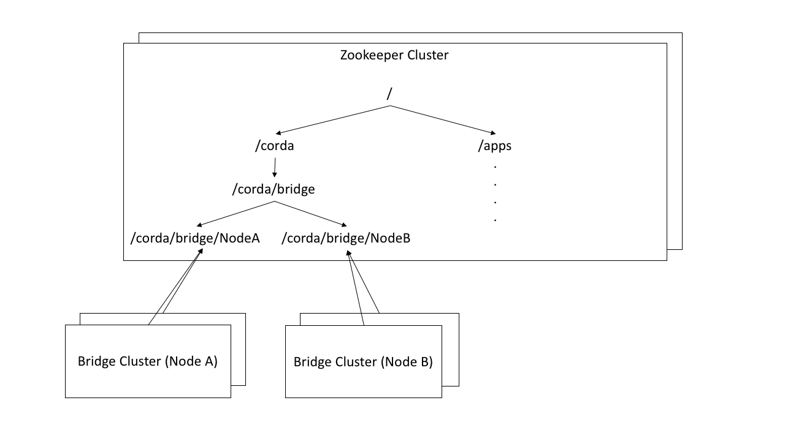

---
aliases:
- /releases/4.0/corda-firewall-component.html
date: '2020-01-08T09:59:25Z'
menu:
  corda-enterprise-4-0:
    identifier: corda-enterprise-4-0-corda-firewall-component
    parent: corda-enterprise-4-0-corda-firewall
    weight: 1010
tags:
- corda
- firewall
- component
title: Firewall Component Overview
---


# Firewall Component Overview


## Introduction

The Corda Firewall (bridge/float) component is designed for enterprise deployments and acts as an application-level
firewall and protocol break on all internet facing endpoints. The `corda-firewall.jar` encapsulates the peer
network functionality of the basic Corda Enterprise node, so that it can be operated separately from the security sensitive
JVM runtime of the node. This gives separation of functionality and ensures that the legal identity keys are not
used in the same process as the internet TLS connections. Only the bridge component is initiating connections to the
float further increasing the isolation of the node’s internet access point. Also, it adds support for enterprise deployment
requirements, such as High Availability (HA) and SOCKS proxy support. The firewall can also serve two or more nodes, thus reducing
the deployment complexity of multiple nodes in the same network.

This document is intended to provide an overview of the architecture and options available.


## Terminology

The component referred to here as the *bridge* is the library of code responsible for managing outgoing links to peer
nodes and implements the AMQP 1.0 protocol over TLS 1.2 between peers to provide reliable flow message delivery. This
component can be run as a simple integrated feature of the node. However, for enhanced security and features in Corda
Enterprise, the in-node version should be turned off and a standalone and HA version can be run from the
`corda-firewall.jar`, possibly integrating with a SOCKS proxy.

The *float* component refers to the inbound socket listener, packet filtering and DMZ compatible component. In the
simple all-in-one node, all inbound peer connections terminate directly onto an embedded Artemis broker component
hosted within the node. The connection authentication and packet filtering is managed directly via Artemis
permission controls managed directly inside the node JVM. For Corda Enterprise deployments, we provide a more
secure and configurable isolation component that is available using code inside `corda-firewall.jar`. This
component is designed to provide a clear protocol break and thus prevents the node and Artemis server ever being
directly exposed to peers. For simpler deployments with no DMZ, the float and bridge logic can also be run as a
single application behind the firewall, but still protecting the node and hosted Artemis. It is also possible to host
the Artemis server out of process and shared across nodes, but this will be transparent to peers as the interchange
protocol will continue to be AMQP 1.0 over TLS.


All deployment modes of the bridge, float, or all-in-one node are transparently interoperable, if correctly configured.



## Message path between peer nodes

When a flow within a node needs to send a message to a peer, there is a carefully orchestrated sequence of steps to ensure
correct secure routing based upon the network map information and to ensure safe, restartable delivery to the remote flow.
Adding the bridge and float to this process adds some extra steps and security checking of the messages.
The complete sequence is therefore:


* The flow calls `send`, or `sendAndReceive` to propagate a message to a peer. This leads to checkpointing
of the flow fiber within the `StateMachine` and posting the message to the internal `MessagingService`. This ensures that
the send activity will be retried if there are any errors before further durable transmission of the message.
* The `MessagingService` checks if this is a new destination node and if an existing out queue and bridge exists in Artemis.
If the durable out queue does not exist, then this will need to be created in Artemis:
* First, the durable queue needs to be created in the peer-to-peer Artemis. Each queue is uniquely named based upon the hash of the
legal identity `PublicKey` of the target node.
* Once the queue creation is complete, a bridge creation request is also published to the Artemis bus via the bridge control protocol.
This message uses information from the network map to link the out queue to the target host and port and TLS credentials.
The flow does not need to wait for any response at this point and can carry on to send messages to the Artemis out queue.
* The message when received by the bridge process opens a TLS connection to the remote peer (optionally, this
connection can be made via a SOCKS4/5 proxy). On connect the two ends of the TLS link exchange certificate details
and confirm that the certificate path is anchored at the network root certificate and that the X500 subject matches
the expected target as specified in the create bridge message using details contained in the network map.
The links are long lived so as to reduce the setup cost of the P2P messaging.
In future, there may also be denial-of-service protection measures applied.
* If the outgoing TLS 1.2 link is created successfully, then the bridge opens a consumer on the Artemis out queue.
The pending messages will then be transferred to the remote destination using AMQP 1.0, with final removal from the
out queue only occurring when the remote end fully acknowledges safe message receipt. This ensures at least once
delivery semantics.
* Note that at startup of either the node or the bridge, the bridge control protocol resynchronises the bridging state,
so that all out queues have an active bridge.
* Assuming an out queue exists, the message can be posted to Artemis and the bridge should eventually deliver this
message to the remote system.
* On receipt of a message acknowledge from Artemis, the `StateMachine` can continue flow if it is not awaiting a response
(that is, a `send` operation). Otherwise it remains suspended waiting for the reply.
* The receiving end of the bridge TLS 1.2 /AMQP 1.0 link might be the Artemis broker of a remote node,
but for now we assume it is an enterprise deployment that is using a float process running behind a firewall.
The receiver will already have confirmed the validity of the TLS originator when it accepted the TLS handshake.
However, the float does some further basic checking of received messages and their associated headers.
For instance, the message must be targeted at an inbox address and must be below the network parameters defined `maxMessageSize`.
* Having passed initial checks on the message, the float bundles up the message and originator as a payload to be
sent across the DMZ internal firewall. This inbound message path uses a separate AMQP 1.0/TLS 1.2 control tunnel.
(Note that this link is initiated from the local master bridge in the trusted zone to the float in the DMZ. This allows a
simple firewall rule to be configured which blocks any attempts to probe the internal network from the DMZ.)
Once the message is forwarded, the float keeps track of the delivery acknowledgements,
so that the original sender will consume the message in the source queue, only on final delivery to the peer inbox.
Any disconnections, or problems will send a reject status leading to redelivery from source.
* The bridge process, having now received custody of the message, does further checks that the message is good. At the
minute the checks are essentially of well formedness of the message and that the source and destination are valid.
However, future enhancements may include deep inspection of the message payload for CorDapp blacklisting, and other purposes.
Any problems and the message is acknowledged to prevent further redelivery, logged to audit and dropped.
* Assuming this is a normal message, it is passed on to the Artemis inbox and on acknowledgment of delivery,
is cascaded back. Thus, Artemis acknowledgement leads to acknowledgement of the tunnel AMQP packet,
which acknowledges the AMQP back to the sending bridge and that finally marks the Artemis out queue item as consumed.
To prevent this leading to very slow, one-after-the-other message delivery, the AMQP channels use sliding window flow control.
(Currently, a practical default is set internally and the window size is not user configurable.)
* The `MessagingService` on the peer node will pick up the message from the inbox on Artemis, carry out any necessary
deduplication. This deduplication is needed as the distributed restartable logic of the Corda wire protocol only
offers 'at least once' delivery guarantees.
The resulting unique messages are then passed to the `StateMachine` so that the remote flow can be woken up.
* The reply messages use the authenticated originator flag attached by the float to route the replies back to the
correct originator.
The message reply path is not via the inbound path, but instead is via a separately validated route
from the local bridge to the original node’s float and then on to the original node via Artemis.


## Operating modes of the Bridge and Float with a single node


### Embedded Developer Node (node + artemis + internal bridge, no float, no DMZ)


#### Prerequisites


* Java runtime
* Corda Enterprise JAR

The simplest development deployment of the node is without firewall and thus just use the embedded bridge and Peer-to-Peer
Artemis with the node as TLS endpoint and to have the outgoing packets use the internal bridge functionality.
Typically this should only be used for easy development, or for organisations evaluating on Open Source Corda,
where this is the only available option:


### Node + Combined Bridge/Float (no DMZ)


#### Prerequisites


* Java runtime
* Corda Enterprise JAR
* Corda Firewall JAR

The next simplest deployment is to turn off the built in bridge using the `externalBridge` enterprise config property
and to run a single combined firewall process. This might be suitable for a test environment, to conserve VMs.



Note that to run the firewall and the node on the same machine there could be a port conflict with a naive `node.conf` setup,
but by using the `messagingServerAddress` property to specify the bind address and port plus setting
`messagingServerExternal = false`
the embedded Artemis P2P broker can be set to listen on a different port rather than the advertised `p2paddress` port.
Then configure an all-in-one bridge to point at this node’s `messagingServerAddress`:




#### node.conf

```javascript
myLegalName = "O=Bank A, L=New York, C=US"

# This is the address advertised into the network map. As such it must be the publicly resolved IP,
# or DNS name that will allow peers to connect to the float.
p2pAddress = "banka.com:10005"

messagingServerAddress = "nodeserver:11005"
messagingServerExternal = false

enterpriseConfiguration {
  externalBridge = true
}

rpcSettings = {
    address: "nodeserver:10006"
    adminAddress="nodeserver:10007"
}

```

[node.conf](resources/bridge/node_bridge/node.conf)


#### bridge.conf

```javascript
firewallMode = SenderReceiver
outboundConfig {
    artemisBrokerAddress = "nodeserver:11005"
}
inboundConfig {
    listeningAddress = "bridgeexternal:10005"
}
networkParametersPath = network-parameters

```

[bridge.conf](resources/bridge/node_bridge/bridge.conf)


### DMZ ready (node + bridge + float)


#### Prerequisites


* Java runtime
* Corda Enterprise JAR
* Corda Firewall JAR

To familiarize oneself with the a more complete deployment including a DMZ and separated inbound and outbound paths
the `firewallMode` property in the `firewall.conf` should be set to `BridgeInner` for the bridge and
`FloatOuter` for the DMZ float. These mode names were chosen to remind users that the `bridge` should run in the trusted
*inner* network zone and the `float` should run in the less trusted *outer* zone.
The diagram below shows such a non-HA deployment. This would not be recommended for production, unless used as part of a cold DR type standby.


Note that whilst the bridge needs access to the official TLS private
key, the tunnel link should use a private set of link specific keys and certificates. The float will be provisioned
dynamically with the official TLS key when activated via the tunnel and this key will never be stored in the DMZ:




#### node.conf

```javascript
myLegalName = "O=Bank A, L=New York, C=US"

# This is the address advertised into the network map. As such it must be the publicly resolved IP,
# or DNS name that will allow peers to connect to the float.
p2pAddress = "banka.com:10005"

messagingServerAddress = "nodeserver:11005"
messagingServerExternal = false

rpcSettings {
    address = "nodeserver:10006"
    adminAddress = "nodeserver:10007"
}

enterpriseConfiguration = {
    externalBridge = true
}

```

[node.conf](resources/bridge/node_bridge_float/node.conf)


#### bridge.conf

```javascript
bridgeMode = BridgeInner
outboundConfig {
    artemisBrokerAddress = "nodeserver:11005"
}
bridgeInnerConfig {
    floatAddresses = [ "dmzinternal:12005" ]
    expectedCertificateSubject = "CN=Float Local,O=Tunnel,L=London,C=GB"
    customSSLConfiguration {
           keyStorePassword = "bridgepass"
           trustStorePassword = "trustpass"
           sslKeystore = "./bridgecerts/bridge.jks"
           trustStoreFile = "./bridgecerts/trust.jks“
           crlCheckSoftFail = true
    }
}
networkParametersPath = network-parameters
```

[bridge.conf](resources/bridge/node_bridge_float/bridge.conf)


#### float.conf

```javascript
bridgeMode = FloatOuter
inboundConfig {
    listeningAddress = "dmzexternal:10005"
}
floatOuterConfig {
    floatAddress = "dmzinternal:12005"
    expectedCertificateSubject = "CN=Bridge Local,O=Tunnel,L=London,C=GB"
    customSSLConfiguration {
           keyStorePassword = "floatpass"
           trustStorePassword = "trustpass"
           sslKeystore = "./floatcerts/float.jks"
           trustStoreFile = "./floatcerts/trust.jks“
           crlCheckSoftFail = true
    }
}
networkParametersPath = network-parameters

```

[float.conf](resources/bridge/node_bridge_float/float.conf)


### DMZ ready with outbound SOCKS


#### Prerequisites


* Java runtime
* Corda Enterprise JAR
* Corda Firewall JAR
* SOCKS Proxy

Some organisations require dynamic outgoing connections to operate via a SOCKS proxy. The code supports this option
by adding extra information to the `outboundConfig` section of the bridge process. A simplified example deployment is shown here
to highlight the option:


#### node.conf

```javascript
myLegalName = "O=Bank A, L=New York, C=US"

# This is the address advertised into the network map. As such it must be the publicly resolved IP,
# or DNS name that will allow peers to connect to the float.
p2pAddress = "banka.com:10005"

messagingServerAddress = "nodeserver:11005"
messagingServerExternal = false

rpcSettings {
    address = "nodeserver:10006"
    adminAddress = "nodeserver:10007"
}

enterpriseConfiguration = {
    externalBridge = true
}

```

[node.conf](resources/bridge/socks_proxy/node.conf)


#### bridge.conf

```javascript
bridgeMode = BridgeInner
outboundConfig {
    artemisBrokerAddress = "nodeserver:11005"
    socksProxyConfig {
       version = SOCKS5
       proxyAddress = "proxyserver:12345"
       username = "proxyuser"
       password = "password"
    }
}
bridgeInnerConfig {
    floatAddresses = ["dmzinternal:12005" ]
    expectedCertificateSubject = "CN=Float Local,O=Tunnel,L=London,C=GB"
    customSSLConfiguration {
           keyStorePassword = "bridgepass"
           trustStorePassword = "trustpass"
           sslKeystore = "./bridgecerts/bridge.jks"
           trustStoreFile = "./bridgecerts/trust.jks“
           crlCheckSoftFail = true
    }
}
networkParametersPath = network-parameters

```

[bridge.conf](resources/bridge/socks_proxy/bridge.conf)


#### float.conf

```javascript
bridgeMode = FloatOuter
inboundConfig {
    listeningAddress = "dmzexternal:10005"
}
floatOuterConfig {
    floatAddress = "dmzinternal:12005"
    expectedCertificateSubject = "CN=Bridge Local,O=Tunnel,L=London,C=GB"
    customSSLConfiguration {
           keyStorePassword = "floatpass"
           trustStorePassword = "trustpass"
           sslKeystore = "./floatcerts/float.jks"
           trustStoreFile = "./floatcerts/trust.jks“
           crlCheckSoftFail = true
    }
}
networkParametersPath = network-parameters

```

[float.conf](resources/bridge/socks_proxy/float.conf)


### Full production HA DMZ ready mode (hot/cold node, hot/warm bridge)


#### Prerequisites


* Java runtime
* Corda Enterprise JAR
* Corda Firewall JAR
* Zookeeper v3.5.4-beta
* Optional: SOCKS Proxy

Finally, we show a full HA solution as recommended for production. This does require adding an external ZooKeeper
cluster to provide bridge master selection and extra instances of the bridge and float. This allows
hot-warm operation of all the bridge and float instances. The Corda Enterprise node should be run as hot-cold HA too.
Highlighted in the diagram is the addition of the `haConfig` section to point at `zookeeper` and also the use of secondary
addresses in the `alternateArtemisAddresses` to allow node failover and in the `floatAddresses` to point at a
pool of DMZ float processes.


#### node.conf

```javascript
myLegalName = "O=Bank A, L=New York, C=US"

# This is the address advertised into the network map. As such it must be the publicly resolved IP,
# or DNS name that will allow peers to connect to the float.
p2pAddress = "banka.com:10005"

messagingServerAddress = "artemiserver:11005"
messagingServerExternal = true

rpcSettings {
    address = "nodeserver1:10006"
    adminAddress = "nodeserver1:10007"
}

enterpriseConfiguration = {
    externalBridge = true
    mutualExclusionConfiguration = {
        on = true
        machineName = "nodeserver1"
        updateInterval = 20000
        waitInterval = 40000
    }
}

```

[node.conf](resources/bridge/ha_nodes/node.conf)


#### bridge.conf

```javascript
bridgeMode = BridgeInner
outboundConfig {
    artemisBrokerAddress = "artemiserver:11005"
}
bridgeInnerConfig {
    floatAddresses = ["dmzinternal1:12005", "dmzinternal2:12005"]
    expectedCertificateSubject = "CN=Float Local,O=Tunnel,L=London,C=GB"
    customSSLConfiguration {
           keyStorePassword = "bridgepass"
           trustStorePassword = "trustpass"
           sslKeystore = "./bridgecerts/bridge.jks"
           trustStoreFile = "./bridgecerts/trust.jks“
           crlCheckSoftFail = true
    }
}
haConfig {
    haConnectionString = "zk://zookeep1:11105,zk://zookeep2:11105 ,zk://zookeep3:11105"
}
networkParametersPath = network-parameters

```

[bridge.conf](resources/bridge/ha_nodes/bridge.conf)


#### float.conf

```javascript
bridgeMode = FloatOuter
inboundConfig {
    listeningAddress = "dmzexternal1:10005"
}
floatOuterConfig {
    floatAddress = "dmzinternal1:12005"
    expectedCertificateSubject = "CN=Bridge Local,O=Tunnel,L=London,C=GB"
    customSSLConfiguration {
           keyStorePassword = "floatpass"
           trustStorePassword = "trustpass"
           sslKeystore = "./floatcerts/float.jks"
           trustStoreFile = "./floatcerts/trust.jks“
           crlCheckSoftFail = true
    }
}
networkParametersPath = network-parameters
```

[float.conf](resources/bridge/ha_nodes/float.conf)


## Operating modes of shared Bridge and Float


### Multiple nodes + Bridge (no float, no DMZ)


#### Prerequisites


* Java runtime
* Corda Enterprise JAR
* Corda Firewall JAR
* Apache Artemis v2.6.2 or RedHat amq broker v7.2.2
* Optional: Zookeeper v3.5.4-beta if using Bridge cluster

It is possible to allow two or more Corda nodes (HA and/or non-HA) handle outgoing and incoming P2P communication through a shared bridge. This is possible by configuring the nodes to use
an external Artemis messaging broker which can be easily configured using the ha-tool. For more information, please see [HA Utilities](ha-utilities.md). While this example is the simplest deployment
possible with a shared bridge, any other configuration previously presented can be created.


#### bank-a-node.conf

```javascript
myLegalName = "O=Bank A, L=New York, C=US"

keyStorePassword = "entityAStorePass"
trustStorePassword = "nodeTrustpass"

p2pAddress="bank.com:10005"

messagingServerAddress = "artemisServer:11005"
messagingServerExternal = true

enterpriseConfiguration {
  externalBridge = true
  messagingServerConnectionConfiguration = "CONTINUOUS_RETRY"
  messagingServerSslConfiguration = {
    sslKeystore = artemis/artemis.jks
    keyStorePassword = artemisStorePass
    trustStoreFile = artemis/artemis-truststore.jks
    trustStorePassword = artemisTrustpass
  }
}

rpcSettings = {
        address: "nodeserver:10006"
        adminAddress="nodeserver:10007"
}

```

[bank-a-node.conf](resources/bridge/multiple_non_ha_nodes/bank-a-node.conf)


#### bank-b-node.conf

```javascript
myLegalName = "O=Bank B, L=New York, C=US"

keyStorePassword = "entityBStorePass"
trustStorePassword = "nodeTrustpass"

p2pAddress="bank.com:10005"

messagingServerAddress = "artemisServer:11005"
messagingServerExternal = true

enterpriseConfiguration {
  externalBridge = true
  messagingServerConnectionConfiguration = "CONTINUOUS_RETRY"
  messagingServerSslConfiguration = {
    sslKeystore = artemis/artemis.jks
    keyStorePassword = artemisStorePass
    trustStoreFile = artemis/artemis-truststore.jks
    trustStorePassword = artemisTrustpass
  }
}

rpcSettings = {
        address: "nodeserver:10016"
        adminAddress="nodeserver:10017"
}

```

[bank-b-node.conf](resources/bridge/multiple_non_ha_nodes/bank-b-node.conf)


#### bridge.conf

```javascript
firewallMode = SenderReceiver

outboundConfig {
    artemisBrokerAddress = "artemisServer:11005"
    artemisSSLConfiguration = {
        sslKeystore = artemis/artemis.jks
        keyStorePassword = artemisStorePass
        trustStoreFile = artemis/artemis-truststore.jks
        trustStorePassword = artemisTrustpass
        crlCheckSoftFail = true
    }
}

inboundConfig {
    listeningAddress = "bridgeexternal:10005"
}

networkParametersPath = network-parameters

sslKeystore = nodesCertificates/nodesUnitedSslKeystore.jks
keyStorePassword = bridgeKeyStorePassword

trustStorePassword = nodeTrustpass
trustStoreFile = nodesCertificates/truststore.jks
```

[bridge.conf](resources/bridge/multiple_non_ha_nodes/bridge.conf)


### Adding new nodes to existing shared Bridge

Most of the HA components are agnostic to the node, with exception of the bridge which needs to have access to the node’s SSL key in order to establish TLS connection to the counterparty nodes.

The bridge’s SSL keystore will need to be updated when adding new node to the shared HA infrastructure. This can be done by using any keytool or by using [HA Utilities](ha-utilities.md),
the *SSL key copier* is tailored to import multiple node’s SSL keys into the bridge’s keystore.

A simple procedure for adding a new node might look like the following:


* Back up and shut down all Corda components - Nodes, Bridges, Artemis broker and Float.
* Register your new entities with the network operator. See [Joining an existing compatibility zone](joining-a-compatibility-zone.md).
* Locate the SSL keystore file in node’s certificate folder. e.g. `<node base directory>/certificates/sslkeystore.jks`
* Copy the SSL keystores generated from the registration process to Bridge if they are on a different host.
* Using the [HA Utilities](ha-utilities.md), copy the newly acquired legal entity’s SSL key to the bridge’s SSL keystore.
`ha-utilities import-ssl-key --node-keystores <<Node keystore path>> --node-keystore-passwords=<<Node keystore password>> --bridge-keystore=<<Bridge keystore path>> --bridge-keystore-password=<<Bridge keystore password>>`
* Start the Bridge and other nodes.


## Standalone Artemis server

The Corda node can be configured to use a external Artemis broker instead of embedded broker to provide messaging layer HA capability in enterprise environment.

Detailed setup instructions for Apache Artemis can be found in [Apache Artemis documentation](https://activemq.apache.org/artemis/docs/latest/index.html). Also see
[HA Utilities](ha-utilities.md) for Artemis server configuration tool, which you can use to build a local, configured for Corda, Apache Artemis directory.


To run Apache Artemis you can use: `cd artemis && bin/artemis run`


We have tested Corda against Apache Artemis v2.6.2 and RedHat amq broker v7.2.2. It is recommended to use these Artemis versions with Corda.


## Apache ZooKeeper

Apache ZooKeeper is used in Corda firewall to manage the hot/warm bridge clusters. Because hot/hot is not supported,ZooKeeper is used to ensure only 1 instance of the bridge is active at all time.
The ZooKeeper instance is also used for signals failover when the active bridge is disconnected. ZooKeeper does not process or store any data regarding transactions or P2P communication.


### Setting up ZooKeeper cluster

ZooKeeper can be deployed in single-server or multi-server setup. A clustered (multi-Server) setup is recommended for production use, for added fault tolerance and reliability.

Detailed setup instructions can be found in [Apache ZooKeeper documentation](https://zookeeper.apache.org/doc/r3.5.4-beta/zookeeperAdmin.html#sc_zkMulitServerSetup).


Only Apache ZooKeeper version 3.5.4-beta is compatible due to Apache Curator v4.2.0 dependencies.



### Sharing ZooKeeper

A single ZooKeeper cluster instance can be shared between multiple bridge clusters to reduce infrastructure cost. The `haConfig.haTopic` can be configured to allow each bridge cluster to access a different ZooKeeper path.


The above example shows multiple Corda bridges (NodeA and NodeB) connecting to the same ZooKeeper server.
Node A and B have their own namespaces in ZooKeeper, which allow them to operate in the same ZooKeeper without interfering each other.

This setup can be configured by setting NodeA and B’s `haConfig.haTopic` to `/corda/bridge/NodeA` and `/coda/bridge/NodeB` respectively, the parent nodes (/corda and /corda/bridge) will be created automatically upon connection.


## ZooKeeper alternative

It is possible to have the hot-warm capability of the bridge and float clusters without the added deployment complexity of a ZooKeeper cluster. The firewall provides a `Bully Algorithm` implementation for master election which can be enabled
by simply changing the `haConnectionString` configuration property from `zk://<host>:<port>` to the pseudo-url `bully://localhost` (the host is a dummy string). This feature uses Publish/Subscribe messages on the P2P Artemis messaging broker for coordination. Please be aware that
this approach does not protect against network partitioning problems, therefore it is strongly recommended to use ZooKeeper in production environments.
