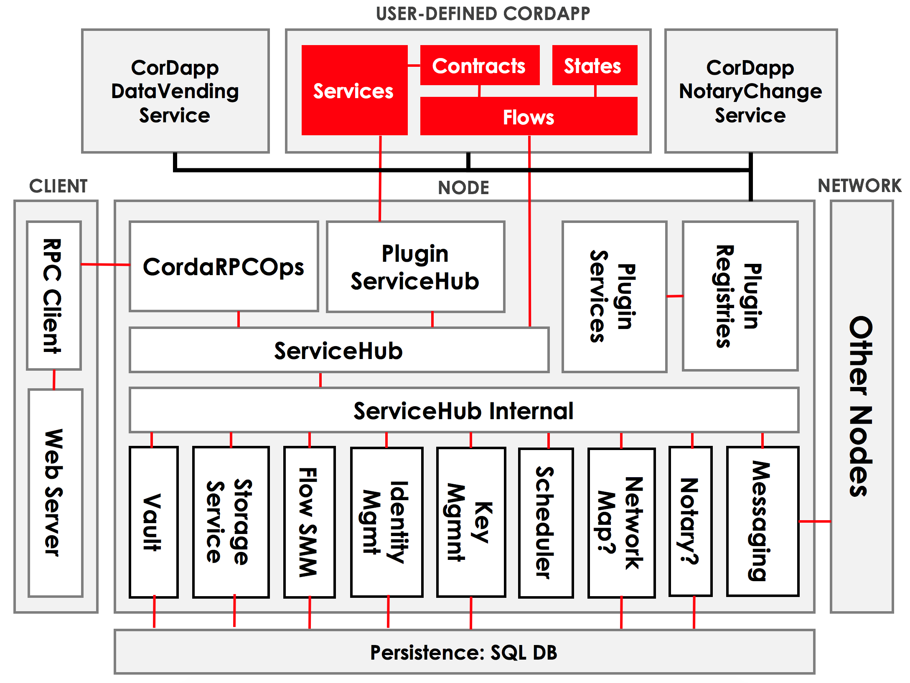

---
aliases:
- /releases/release-V1.0/key-concepts-node.html
date: '2020-01-08T09:59:25Z'
menu:
  corda-os-1-0:
    identifier: corda-os-1-0-key-concepts-node
    parent: corda-os-1-0-key-concepts
    weight: 1130
tags:
- concepts
- node
title: Nodes
---

# Nodes



# Summary

* *A node is JVM run-time with a unique network identity running the Corda software*
* *The node has two interfaces with the outside world:*> 

    * *A network layer, for interacting with other nodes*
    * *RPC, for interacting with the node’s owner*

* *The node’s functionality is extended by installing CorDapps in the plugin registry*



## Video

<a href="https://vimeo.com/214168860">Corda Node, CorDapps and Network</a>

<iframe src="https://player.vimeo.com/video/214168860" width="640" height="360" frameborder="0" webkitallowfullscreen="true" mozallowfullscreen="true" allowfullscreen="true"></iframe>

## Node architecture

A Corda node is a JVM run-time environment with a unique identity on the network that hosts Corda services and
CorDapps.

We can visualize the node’s internal architecture as follows:

The core elements of the architecture are:

* A persistence layer for storing data
* A network interface for interacting with other nodes
* An RPC interface for interacting with the node’s owner
* A service hub for allowing the node’s flows to call upon the node’s other services
* A plugin registry for extending the node by installing CorDapps

## Persistence layer

The persistence layer has two parts:

* The **vault**, where the node stores any relevant current and historic states
* The **storage service**, where it stores transactions, attachments and flow checkpoints

The node’s owner can query the node’s storage using the RPC interface (see below).

## Network interface

All communication with other nodes on the network is handled by the node itself, as part of running a flow. The
node’s owner does not interact with other network nodes directly.

## RPC interface

The node’s owner interacts with the node via remote procedure calls (RPC). The key RPC operations the node exposes
are documented in [API: RPC operations](api-rpc.md).

## The service hub

Internally, the node has access to a rich set of services that are used during flow execution to coordinate ledger
updates. The key services provided are:

* Information on other nodes on the network and the services they offer
* Access to the contents of the vault and the storage service
* Access to, and generation of, the node’s public-private keypairs
* Information about the node itself
* The current time, as tracked by the node

## The plugin registry

The plugin registry is where new CorDapps are installed to extend the behavior of the node.

The node also has several plugins installed by default to handle common tasks such as:

* Retrieving transactions and attachments from counterparties
* Upgrading contracts
* Broadcasting agreed ledger updates for recording by counterparties

