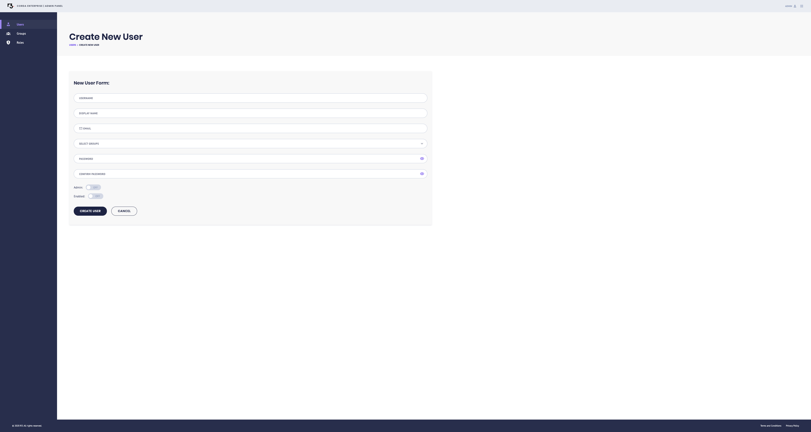
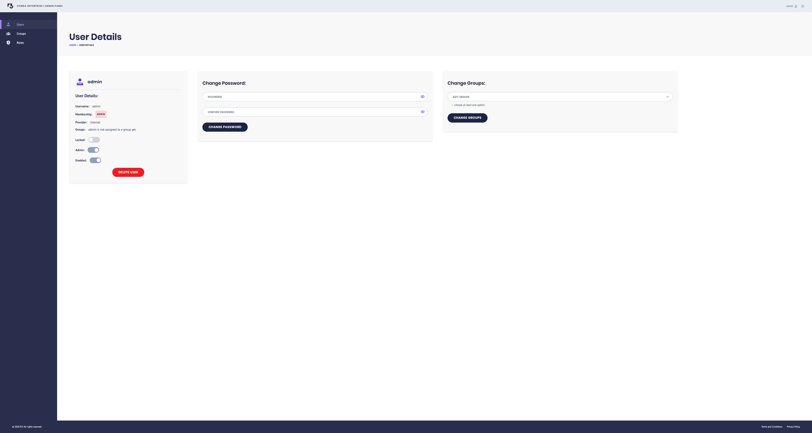
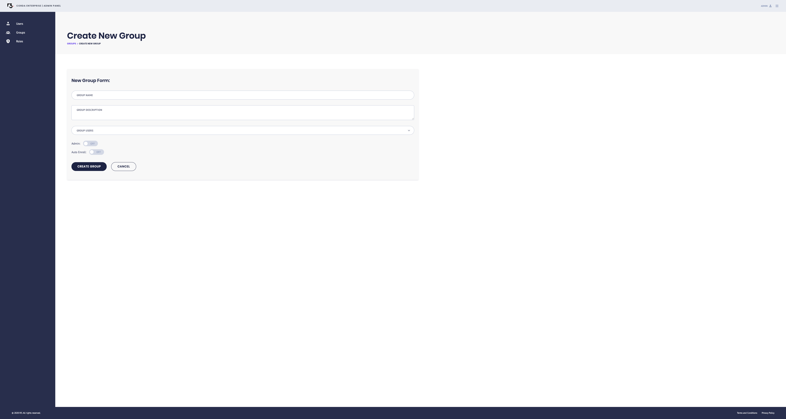
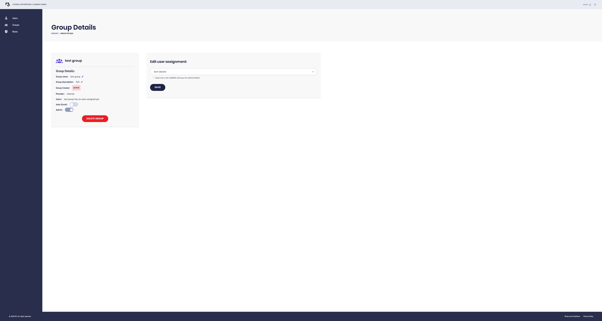
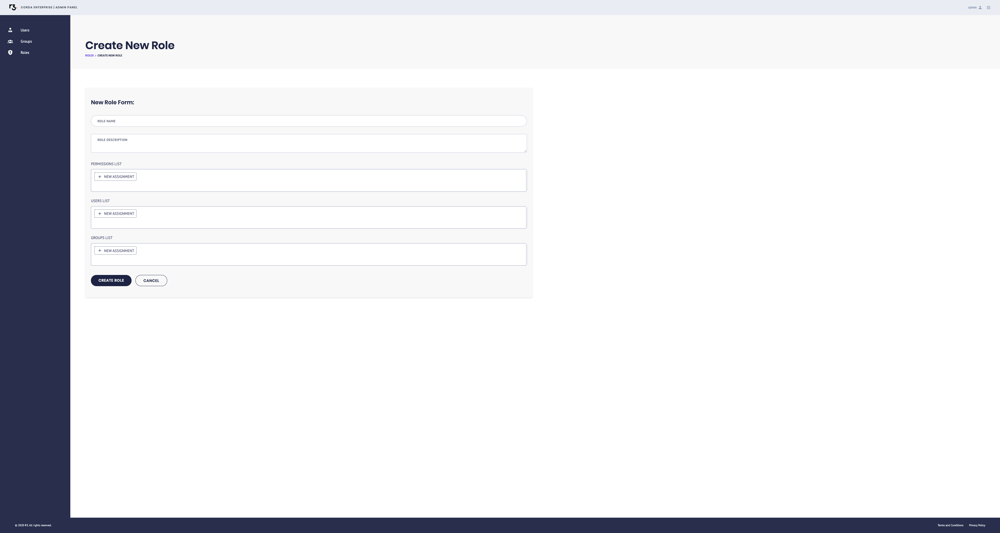
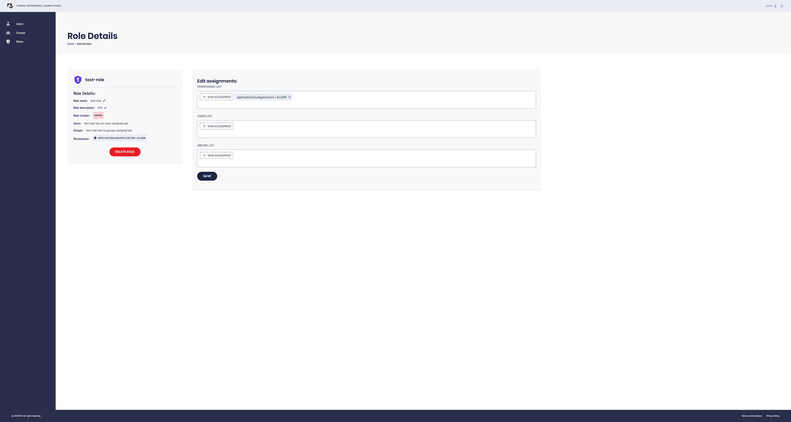

---
aliases:
- /pki-tool.html
- /releases/release-1.2/pki-tool.html
date: '2020-05-22T05:59:25Z'
menu:
  cenm-1-5:
    identifier: cenm-1-5-user-admin-tool
    parent: cenm-1-5-tools-index
    weight: 1015
tags:
- users
-
- tool
title: CENM User Admin tool
---

## CENM User Admin tool

The User Admin tool is a visual interface that allows you to manage the profiles of users, groups, and administrators who need access to your network services. You can use the tool to create roles with specific permissions and assign them to users. For example, you can give a user of the Identity Manager a role that permits them to request the revocation of a network certificate.

With the User Admin tool, you can:

* Add users. A user is anyone who requires access to perform network operations.
* Add administrators. An administrator can add and manage users with the tool. For security reasons, an administrator cannot perform any network operations. Only a user can perform this task.
* Manage user and administrator login details.
* Create and manage groups. A group is comprised of multiple users with shared roles and permissions.
* Create and manage roles. A role is a set of permissions that can be assigned to users and groups of users.

### Who can use it

You need administrator access to use the User Admin tool. If you are the first person using the tool in your organisation, you need to request access from your network owner's organisation.

## Access the User Admin tool

Access the User Admin tool from your [Gateway Service](../../corda-enterprise/4.8/node/gateway-service) instance. Enter the full address of your Gateway Service, including the port number, followed by `/admin` into a web browser.

For example:
`http://10.230.41.12:8080/admin`

### First login

Your initialisation credentials for logging in for the first time are established using the `--initial-user-name` and `--initial-user-password` commands when managing the configuration of the [Auth Service](../../corda-enterprise/4.8/node/auth-service).

If you do not have these, you need to access them from the operator who configured your Auth Service.


For security reasons, you must *delete* the initialising admin user account once you have accessed the User Admin tool.


1. Login with the initialisation credentials.
2. Create your own account as an **Administrator**.
3. Login with your new credentials.
4. Delete the initialisation account.

## Change your password

When logging into the User Admin tool as an administrator for the first time, you must change your temporary password. You can repeat this process whenever you want.

To change your password:

1. Log in to the User Admin tool. If this is your first login or you have requested a new login, use the temporary password you have been given.

2. On the next screen, click *user profile* in the top right-hand corner.

3. On the **User Details** screen, enter and confirm your new password in the **Change user password** fields.

4. Click **Submit**.

You have changed your password. You are automatically logged out of the User Admin tool, and can now log back in using your new password.

## Create a new user or administrator

Users can access network services to perform tasks. To give a user permissions, you can assign them a role, and/or add them to a group with set permissions.

Administrators *cannot* have any role as a user on your network operation services.


You must be registered as an administrator to create new users and administrators.


To add a new user or administrator:

1. Select **Users** from the side menu.

2. Click **Create User**.

3. Fill in the **New User Form**.
    a. Enter a username (required).
    b. Add an optional display name and email.
    b. If you would like to add the user to any groups, select them from the dropdown menu.
    c. Enter and confirm a temporary password - the user can change this when they log in for the first time.

4. If you are creating an administrator, set the **Admin** toggle to 'on'.

5. Set the **Enabled** toggle to 'on' to activate the user. You can return to this step later if you do not need to activate the user yet.

8. Click **Create User** to complete the registration.

9. Send the user their login details. Remind them to change their password.

## Manage a user

You can change a user's status, password, or group membership from the **User Details** screen.

1. Select **Users** from the side menu to view the user list.

2. Click the **Username** of the relevant user.

3. Change a user's status or delete a user from the **User Details** panel:
    * **Locked** toggle: If a user tries an incorrect password too many times, they will be locked. Click the **Locked** toggle to unlock them and allow additional attempts.
    * **Admin** toggle: Activate the **Admin** toggle to make a user an administrator.
    * **Enable** toggle: Deactivate or reactivate a user.
    * **Delete User** button: Remove the user from the system.

    Updates save automatically.

4. Reset passwords from the **Change Password** panel. You are required to enter your own password before you can change another user's.

5. Change a user's group membership from the **Change Groups** panel.

## Create a group

Groups let you grant multiple users the same set of permissions. Groups make it easier for you to manage permissions of future users - just add them to the relevant groups instead of configuring individual roles.

To create a group:

1. Select **Groups** from the side menu. You can see any existing groups.

2. Click **Add Group**.

3. Fill in the **New Group Form**.
    a. Enter a group name (required).
    b. Add a description (optional).
    c. Select group members from the dropdown.
    d. Toggle the **Admin** option on to make all group members administrators.
    e. Toggle the **Auto-Enroll** option on to assign this group to all new users you create.

4. Click **Create Group**.

You can access all your groups from the **Groups** screen.

## Manage a group

You can add or remove members of a group, or delete an existing group. Deleting a group does not delete the users in the group.

To make changes to a group:

1. Select **Groups** from the side menu to view your existing groups.

2. Click the relevant group.

3. Update your group from the  **Group details** panel:
    * **Pencil icons**: Edit the name and description of the group.
    * **Enable** toggle: Activate or deactivate the auto-enrolment of new users into the group.
    * **Admin** toggle: Set the administrator status of the group.
    * **Delete button**: Delete the group. This does not delete the users in the group - they are still active, but do not have any permissions that were assigned at the group level.

    Changes save automatically.

4. Edit the users in a group from the **Edit user assignment** panel.
    a. Click the drop-down menu to see a list of all users.
    b. Select the checkbox next to a user to add them to the group.
    c. Click the **x** next to a user's name to remove them from the group. This will revoke any permissions associated with group membership - you can confirm this by checking the user's individual roles.
    d. Click **Save**.

## Create a new role

Roles are made up of permissions that allow users to perform tasks in CENM. You can create roles by combining the required permissions, and then assigning the role to users and/or groups.

To create a new role:

1. Select **Roles** from the side menu.

2. Click **Add Role**.

3. Fill in the **New Role Form**:
    a. Enter a role name (required).
    b. Add a description (optional).
    c. Assign permissions: Select a permission from the list, then choose whether you want to *allow* that permission for users with the role or *deny* that permission for all users with the role.
    d. Assign the role to one or more users. Select the role from the **Assignment** dropdown, then choose the scope of the role from the **Effect** dropdown.
    e. Assign the role to one or more groups, if required. Select the role from the **Assignment** dropdown, then choose the scope of the role from the **Effect** dropdown.

8. Click **Create Role**.

You have added a new role. All users and groups assigned this role are granted its permissions with immediate effect.

## Manage a role

You can assign a role to additional users and groups, remove roles from users and groups, add and remove permissions in a role, and delete roles at any time.

To amend the properties of a role:

1. Select **Roles** from the side menu.

2. Click the relevant role.

3. On the **Role Details** screen, add or remove permissions, users, or groups as required using the **Edit** or **Delete** icons in each field.

4. Click **Save**.

You have amended the properties of a role. Your changes will take effect immediately. If you have removed this role from users or groups, they will no longer have permissions associated with that role. If they are logged into the system, they will be unable to perform tasks enabled by this role.
