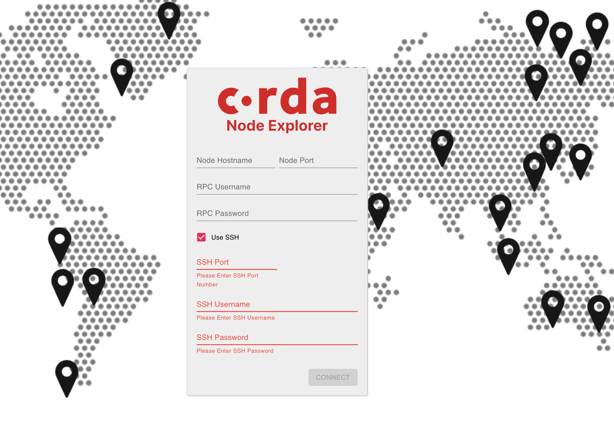
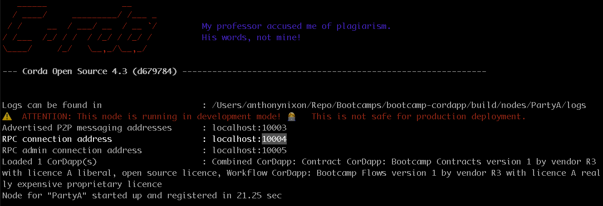
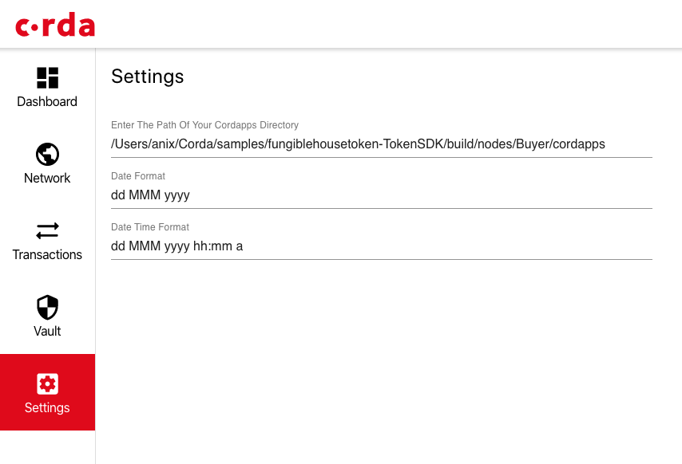
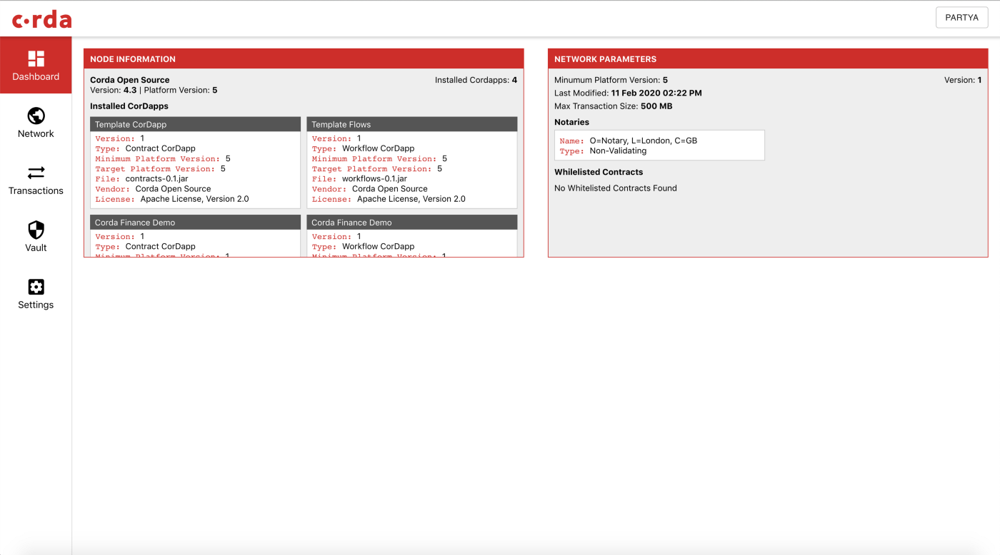
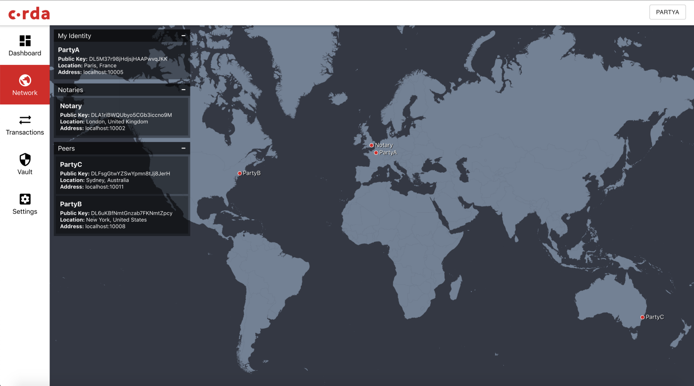
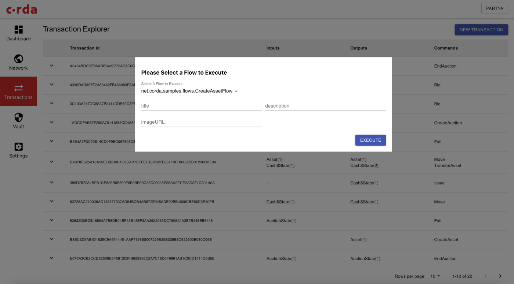
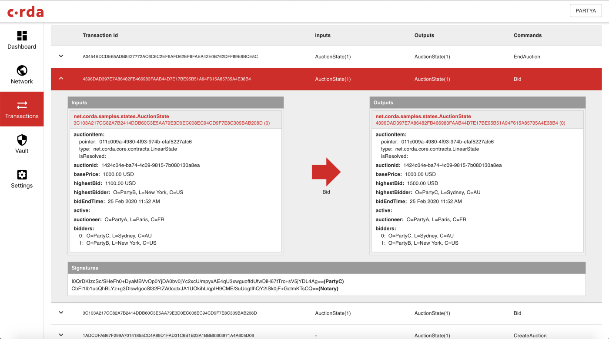
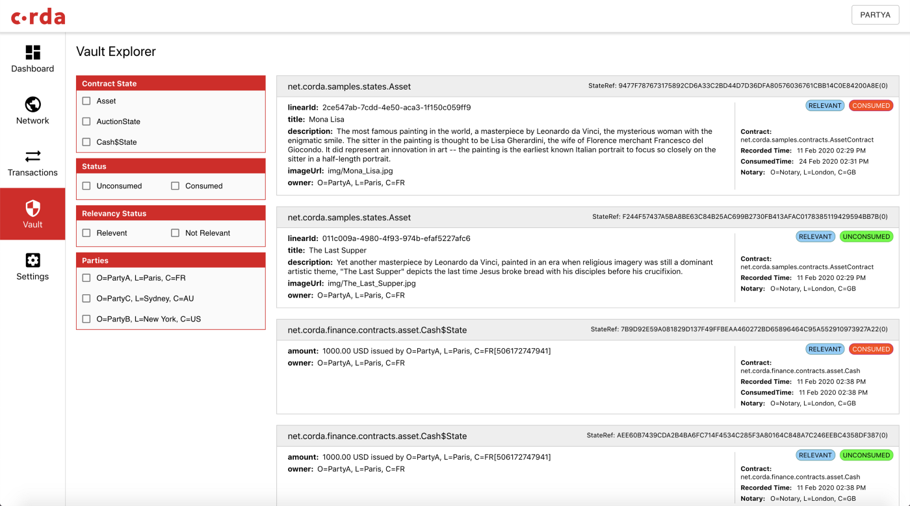

# Node Explorer



This version of Node Explorer replaces and improves upon the retired **Corda Finance Node Explorer**.



Node Explorer is a visual user interface (UI) that allows you to see your node on the network and perform regular tasks. You can view the contents of your node's vault and transaction history. This includes transactions performed both inside and outside of Node Explorer UI.

Use Node Explorer to:

* See the geographical location of your node and counterparts on your network.
* Execute CorDapp flows - such as transactions.
* Review transactions performed in Node Explorer.
* Explore the contents of your node's vault.

## Install Node Explorer

Node Explorer is a standalone tool that accesses your node and its CorDapps using your security credentials - you don't need to install it directly onto any particular node.

### Requirements

To use Node Explorer, you need:

* Access to a node, either locally or remotely.
* Your RPC login details for your local node.
* SSH credentials for access to a remote node.

Node Explorer is available for Mac OSX, Windows, and Linux.  System requirements are matched to the requirements for operating a Corda node.

### Download and install

Download your required Node Explorer from the GitHub repository:

[https://github.com/corda/node-explorer/releases](https://github.com/corda/node-explorer/releases)

Run the installer on your machine in the way you would any other app.

## Access your node with Node Explorer

You can access any node with Node Explorer using the node's login credentials. If you are accessing a local node, or a remote node that is not protected with SSH, you can use the node's RPC login details. To access a remote node, protected by SSH, you also need the relevant port, username, and password.

**To log in to a local or remote node without SSH credentials:**

1. Open Node Explorer.

2. In the **Host name** field, enter the name of the host for your node. If it is a local node on your machine, type **localhost**.

3. In the **Node port** field, enter the RPC connection address for your node.



You can find this address by accessing your node through the command line - you will see the **RPC connection address** listed towards the top of your node's key information.



4. In the **Username** and **Password** fields, enter the username and password you would use to access your node.

Node Explorer dashboard is shown. If you are connecting to this node for the first time, you can now configure the explorer to access your node's CorDapps.

**To log in to a remote node using SSH credentials:**

1. Open Node Explorer.

2. In the **Host name** field enter your remote server address.

3. In the **Node port** field, enter the node port value for your remote node.

4. In the **Username** and **Password** fields, enter the username and password you would use to access your node.

5. Select the **Use SSH** box. Fields for SSH credentials are displayed.

6. In the **SSH port** field, enter the SSH port for your remote node.

7. In the **SSH username** and **SSH password** fields, enter the SSH username and password.

The Node Explorer dashboard is shown. If you are connecting to this node for the first time, you can now configure the explorer to access your node's CorDapps.

## Configure Node Explorer to access CorDapps on your node

Before you can start using Node Explorer to execute flows, you need to add the directory of your CorDapps. This enables the explorer to discover the required parameters for each flow.

To add your CorDapp directory:

1. From Node Explorer dashboard screen, click **Settings** in the menu on the left-hand side of the screen.

2. On the settings screen, add the required directory path in the **Enter the path of your CorDapps directory** field. This is the folder where all the CorDapps are kept for your node.

3. Use the **Date format** and **Date time format** fields to specify the expected date and time formats used by your CorDapps. If you don't enter anything here, the defaults shown are used.

You have configured Node Explorer so it can now access the CorDapps for this node.

## Use the dashboard to get an overview of your nodes

The dashboard is the first screen that opens when you [start Node Explorer](#access-your-node-with-node-explorer).

On the dashboard, you can see two panels with details and diagnostics of two aspects of your node - **Node information** and **Network Parameters**.

In the **Node information** panel you can see:

* The version of Corda your node is using.
* The CorDapps that have been detected by Node Explorer, based on the directory you provided during configuration.
* Basic parameters and details of each individual CorDapp.

In the **Network parameters** panel you can see:

* The Minimum Platform Version (MPV) for nodes on this network.
* The maximum transaction size for the network.
* Notaries on the network, and their status as signatory or non-signatory.
* Whitelisted contracts.

## View the geo-location of your node and network peers

To see a geographical view of your network, click **Network** in the left-hand side menu of the Dashboard screen.



The geographical location of each node is based on the [`locality` property of the node's registered CordaX500 name](https://api.corda.net/api/corda-os/4.4/html/api/kotlin/corda/net.corda.core.identity/-corda-x500-name/index.html)



On the network screen, you can see your Node's location, and the location of peers on your network.

## Execute transaction flows

Node Explorer allows you to execute transaction flows using the CorDapps you have available on your node.



You can use Node Explorer to execute a range of commonly used flows, however not all flows can be executed this way. [Check the compatibility of your CorDapp's flow parameters before you begin](#accepted-flow-parameters).



You can execute each flow by completing the required information in the UI, without any additional coding. Node Explorer identifies the required fields in your CorDapps, and presents them for you to complete.

To execute a transaction flow:

1. From Node Explorer dashboard screen, click **Transactions** in the left-hand side menu.

    The **Transactions explorer** screen is displayed.

2. Click the **New transaction** button in the top right corner.

3. In the **Execute flow** dialog box, select the required flow from the drop-down menu. This is a list of all available flows based on the CorDapps you have shared with Node Explorer.

4. In the dialog box, enter the required parameters for your flow. The information requested here is auto-generated according to your CorDapp's parameters, so you can expect it to be different from flow to flow. You should also [confirm that your flow parameters are accepted in Node Explorer](#accepted-flow-parameters) before you get started.

5. Click **Execute**.

You have executed a flow. If your flow has been executed successfully, a success message is displayed along with a transaction ID.

## View details of a transaction

You can use Node Explorer to review details of transactions on your node.

To review a transaction:

1. From the Dashboard screen, click **Transactions** in the left-hand menu.

2. Select the required transaction.

You have accessed the details of a transaction. You can see general details as well as dynamically generated information, depending on the type of transaction you are viewing.

You can see the transaction organised by the inputs and outputs of the transaction state that exists as a result of an executed flow. There can be multiple inputs and outputs for each transaction - for example, when a loan has been issued and then partly repaid.

## Explore your node's vault

The vault keeps the full transaction history of your node. You can use the dynamically populated filters to explore transactions of all types, for example transactions with a Contract state type of `CashState`.

To access your node's vault:

1. Go to the Dashboard screen.

2. Click **Vault** on the left-hand menu.

The **Vault explorer** screen is displayed.

The filters in the Vault explorer are generated dynamically, they vary from node to node, depending on the kind of transactions that exist in the vault.

## Accepted flow Parameters

You can use Node Explorer to execute flows which have any of the following parameters:

* net.corda.core.identity.Party
* java.lang.String
* java.lang.StringBuilder
* java.lang.StringBuffer
* java.lang.Long
* long
* java.lang.Integer
* int
* java.land.Double
* double
* java.lang.Float
* float
* java.math.BigDecimal
* java.math.BigInteger
* java.lang.Boolean
* boolean
* java.util.UUID
* net.corda.core.contracts.UniqueIdentifier
* net.corda.core.contracts.Amount
* java.time.LocalDateTime
* java.time.LocalDate
* java.time.Instant
* net.corda.core.crypto.SecureHash
* java.util.List
* java.util.Set
* net.corda.core.utilities.OpaqueBytes
