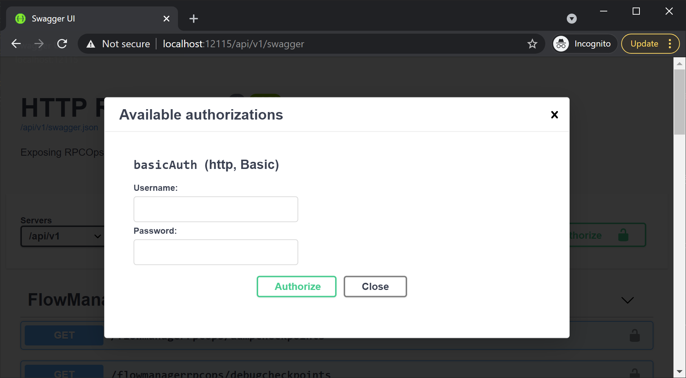
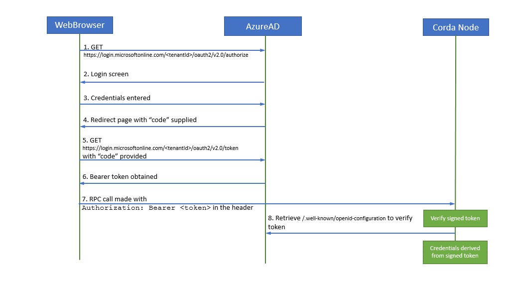
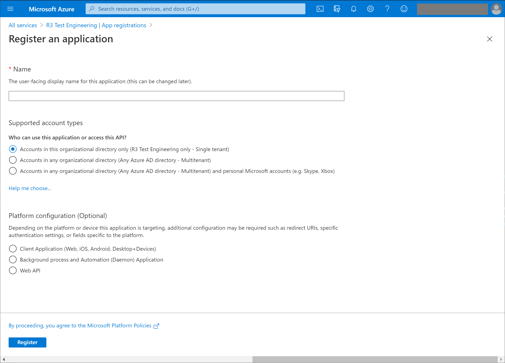
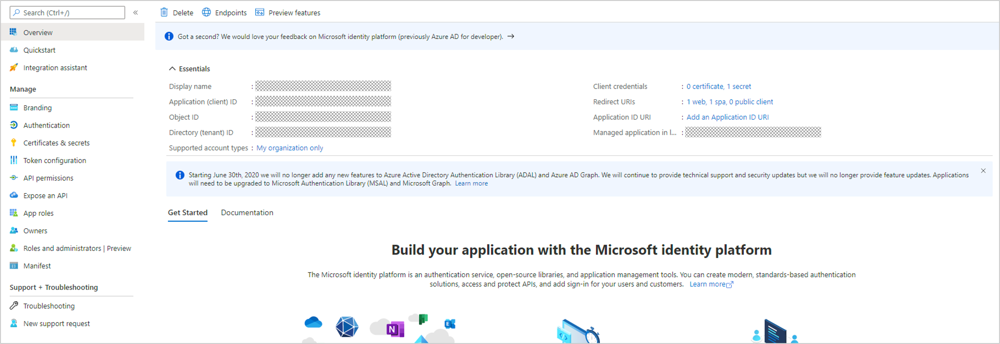
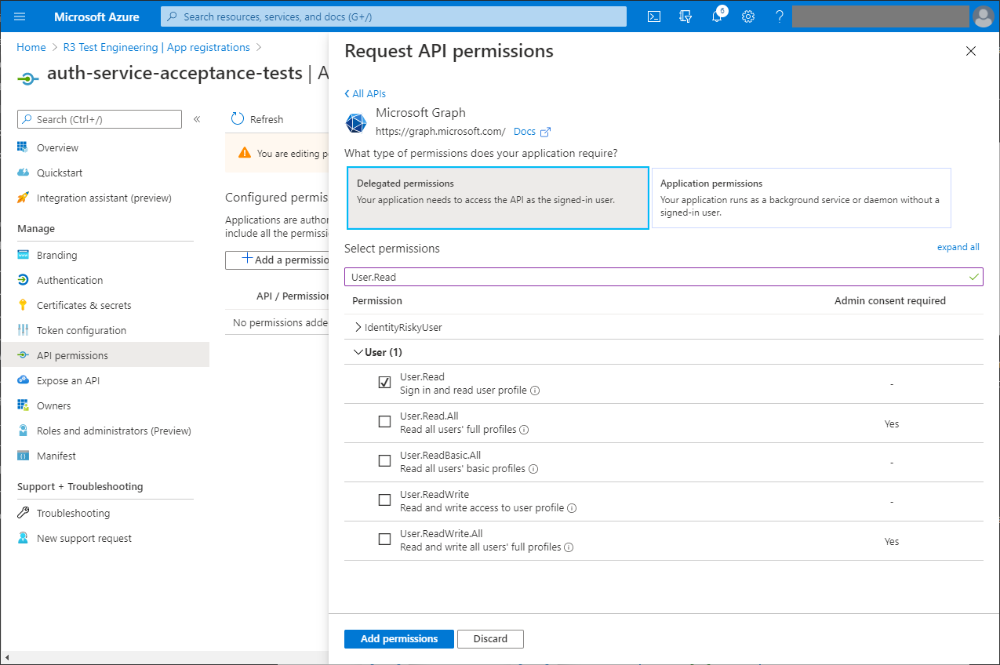
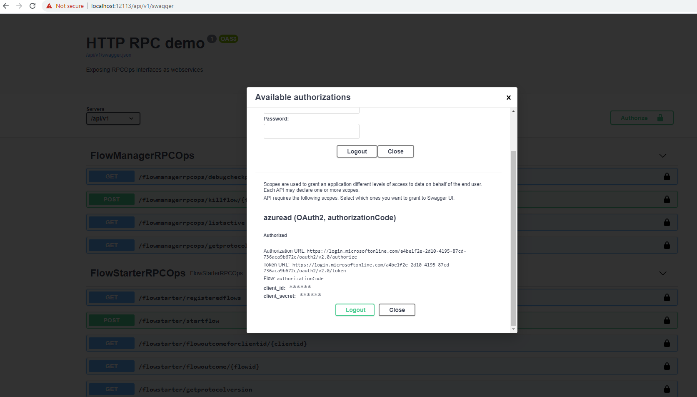

Use this guide to configure authentication and authorization for HTTP-RPC, using basic authentication or Azure Active Directory (AD) single sign-on (SSO).

Most of the endpoints exposed via HTTP-RPC require authentication. `getProtocolVersion` is the only endpoint that doesn't require authentication.

You can test the authentication functionality using Swagger UI (if enabled):




When a client response is unauthorized, the node uses [WWW-Authenticate](https://developer.mozilla.org/en-US/docs/Web/HTTP/Headers/WWW-Authenticate) response headers to provide details on supported authentication types and their parameters.



Nodes support [Basic authentication](#set-up-basic-authentication) and [Azure Active Directory (AD) single sign-on (SSO)](#set-up-azure-ad-sso).

## Set up basic authentication

You can use authenticated HTTP-RPC endpoints with [basic HTTP authentication](https://en.wikipedia.org/wiki/Basic_access_authentication) using the username/password combinations set up for RPC use. To configure user credentials in the `node.conf` file or through the use of an external database, see the guide on [managing RPC security](https://docs.corda.net/docs/corda-os/4.8/clientrpc.html#managing-rpc-security) in Corda 4.

This feature is enabled by default and cannot be disabled.

### Configure authorization

Authorization in this dev preview uses the same Apache Shiro-based solution that was available in Corda 4. For details on how to configure this, see the guide on [managing RPC security](https://docs.corda.net/docs/corda-os/4.8/clientrpc.html#managing-rpc-security) in Corda 4.

### Test your configuration

You can test your configuration using Swagger UI:



## Set up Azure AD SSO

You can set up your node to use Azure Active Directory (AD) for single sign-on (SSO). Authorized users who access HTTP-RPC functions on the node can use their Azure AD credentials to stay logged in to any applications that use the HTTP-RPC API.

1. Configure the Azure AD tenant that serves as an identity provider and the node to enable HTTP-RPC endpoints to support Azure AD-based authentication.

2. Pass an Azure AD **ID token** or **access token** as a [Bearer Token](https://datatracker.ietf.org/doc/html/rfc6750) with the HTTP-RPC requests. The node verifies the following properties/claims of the token:

    * Expiration date.
    * Issuer (should be a valid Microsoft Identity Platform value).
    * Audience (should be the `clientId` of the node).

3. Test this functionality using Swagger UI. The data flow should look like this:




You can generate tokens using any method that is supported by the Microsoft Identity Platform, as long as it can be verified using the parameters above. This may mean different flows are used than those shown in the diagram.


### Configure Azure

The following steps describe a basic setup. Configuring a production setup may include additional steps, such as those for user access management and permission sets (scopes).

To complete the configuration of your node using the [Azure Portal](https://portal.azure.com/):

1. Navigate to the *register an application* screen (Manage > App registration > New registration).

2. Complete the online form to represent your node:



3. Make a note of the "Application (client) ID" and "Directory (tenant) ID". You need these to configure your node.



4. Set authentication to ensure only accounts in this directory can use the app:


5. Make the following menu selections: Manage > Authentication, Platform configuration > Add a platform, Configure platforms > Single-page application.



You may need to use different configuration depending on the types of application that need to access the HTTP-RPC. This setup is for testing with Swagger UI.

Applications accessing the HTTP-RPC should use a different application registration and the [On-Behalf-Of flow](https://docs.microsoft.com/en-us/azure/active-directory/develop/v2-oauth2-on-behalf-of-flow).

You can register an application without implicit flows. You'll need to create a [**client secret**](https://docs.microsoft.com/en-us/azure/active-directory/develop/quickstart-register-app#add-a-client-secret) and include it in the node's `node.conf` file. If you're using the Swagger UI, it can be entered there.



6. Set the **redirect URI** to `http(s)://<host>:<port>/webjars/swagger-ui/3.44.0/oauth2-redirect.html`, and select implicit grant as `ìd_tokens`.

7. Under **Manage**, select **API permissions**, and add user permissions. You must apply `User.Read` as a minimum, but you can select scopes with wider permissions to suit your requirements.



You have finished configuring Azure.

### Configure your node

Azure AD SSO is configured via a top-level object named `httpRpcSettings` in `node.conf`:

```
"httpRpcSettings": {
    ...
    "sso": {
        "azureAd": {
            "clientId": "<client_id>",
            "clientSecret": "<client_secret>"
            "tenantId": "<tenant_id>",
            "principalNameClaims": ["<claim1>", "<claim2>"]
        }
    }
}
```

Configuration options include:

| Field              | Required? | Value |
| ---------------- | --------- | ----- |
| `clientSecret`     | Optional | Auto fills the client-secret field on the Swagger UI authentication page when a non-public client flow is configured on Azure. *This field will be exposed on Swagger UI*. |
| `principalNameClaims` | Optional | A prioritized list of [**claims**](https://docs.microsoft.com/en-us/azure/active-directory/develop/active-directory-optional-claims) that the node retrieves from the Azure AD-generated JSON web token (JWT) to then identify the user and fetch their permissions. Defaults to `["upn", "preferred_username", "email", "appid", "azp"]`.|

### Configure authorization

Permissions are retrieved using the same Apache Shiro-based solution as for [basic authentication](#configure-authorization-for-basic-authentication). However, the actual name
of the user is derived from Azure `claims`.

To specify SSO permissions, add the email address that is associated with their SSO-authenticated user profile to the `node.conf` file.

```
"rpcUsers": [
    {
        "user": "user1@company.com",
        "permissions": [
            "ALL"
        ]
    }
]
```

For Azure AD SSO authentication, **JWT tokens** are used to verify a user's identity. Therefore, users listed in the Shiro database should *not* specify a password in the `node.conf` file.



Username matching uses the extracted principal name claim, which can change depending on the type of JWT provided and the `principalNameClaims` configuration item.



### Test your configuration

You can test your setup using the Swagger UI:


