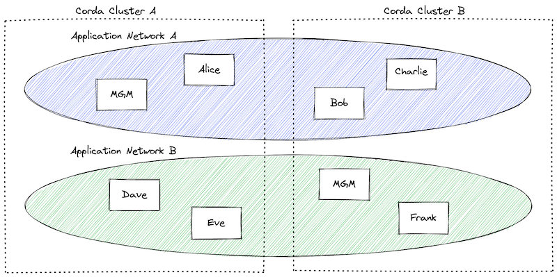

# Interoperability and Corda Façades

Interoperability is a capability of CorDapps to communicate and coordinate activities with peers from
other application networks. These interactions between two different application networks often involve modifications of their
respective ledgers to achieve shared objectives. For instance, an example of interoperability is atomic swap: an atomic
exchange of one asset within an application network for another asset in a different application network.
Atomic swaps represent just one of the various business use cases enabled by Interoperability, which are further
explored in here [TODO link].
This document focuses on the API that empowers CorDapps with Interoperability capabilities. To achieve this, CorDapp
code must be aware of peers (identities) outside its own application network. Additionally, the CorDapp needs
the capability to communicate with or trigger actions on a different CorDapp, even if they do not share a common codebase.
[TODO this is not the final diagram and the right scale]

The Interoperability API is built on the principle of minimizing the exposure of code between
two different CorDapps and addresses the above requirements. This is achieved through the introduction of Façades and
Façade Proxy objects as well as Corda services used in Corda flows.

[MAYBE ADD SOMETHING ABOUT HOW CORDA FACADES ARE DIFFERENT TO GENERIC FACADE TERM USED IN PROGRAMMING?]

The Façade API acts as a bridge, facilitating seamless and secure communication between distinct CorDapps. It enables
them to interact and exchange data while maintaining a clear separation of concerns. The Façade serves as a common
interface definition, abstracting away the implementation details from the underlying CorDapps.
By incorporating Façade Proxy objects alongside other Corda APIs, developers can leverage the power of Interoperability
while maintaining a consistent and familiar development experience.
In the subsequent sections, we delve into the Façade API, exploring its components, functionality, and usage in depth.
We aim to provide a comprehensive guide that empowers developers to harness the full potential of Interoperability in
CorDapps, facilitating cross-network interactions and supporting diverse use cases.

