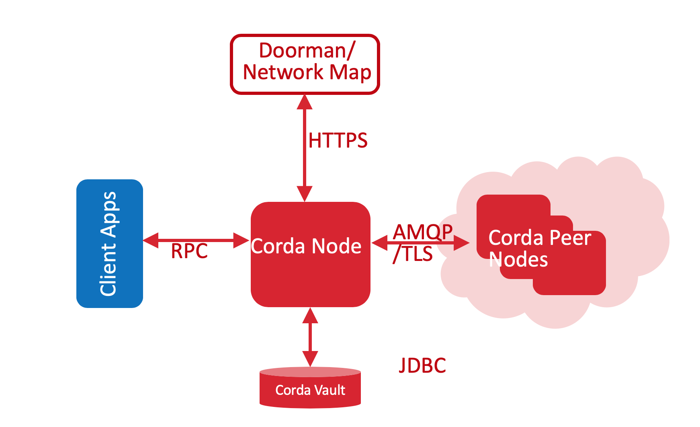
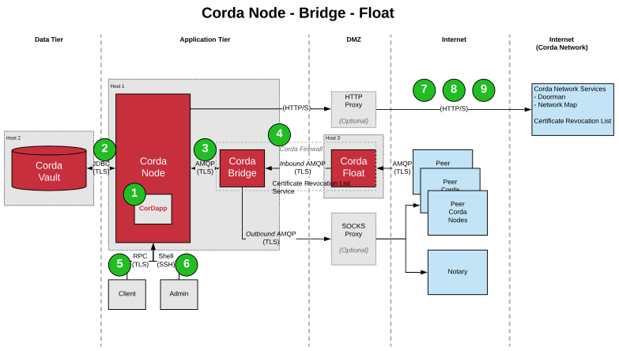

---
aliases:
- /releases/4.4/node/component-topology.html
- /docs/corda-enterprise/head/node/component-topology.html
- /docs/corda-enterprise/node/component-topology.html
date: '2020-01-08T09:59:25Z'
menu:
  corda-enterprise-4-4:
    parent: corda-enterprise-4-4-corda-nodes
tags:
- component
- topology
title: Understanding the node
weight: 1
---

# Understanding the node

It is useful to take a high level perspective of the Corda components, especially the various communication protocols that Corda employs in its operations. The diagram below illustrates the various communication protocols used by the Corda Node communicating with peers on the Corda Network.

Corda Nodes communicate with each other using the asynchronous AMQP/TLS 1.2 protocols. HTTP communication is only used for initial registration of Corda Nodes and sharing the Corda Node address locations by way of the network map. Client applications communicate with Corda Nodes using RPC calls. A Node’s vault is a database that relies on JDBC connection from the Corda Node.

When hosting a Corda Node on-premise, it’s important to consider:

* Corda network architecture allows peer-to-peer networking between Corda Nodes whilst remaining with the security constraints of corporate networking architecture
* On-premise hosting restricts incoming internet access to the Node to only Nodes with valid identity certificates
* Corda networks can safely deploy components in the DMZ
* Corda is designed to prevent man-in-the-middle attacks, requiring that TLS connections are directly terminated between Corda Firewalls
* Does not connect into the internal network, connections are initiated from the Node.

In any given production deployment of Corda Enterprise, the most common components are the Corda Node, vault, and firewall.

A typical Node deployment.

The diagram highlights that:

1. **CorDapps** are the functional aspect of Corda that define the operations of a business network for a given use case.
2. Corda nodes store states in a database (the vault) using **JDBC**.
3. **Corda nodes** communicate in peer-to-peer fashion using **AMQP/TLS 1.2**.
4. **Corda Firewall** is an optional reverse proxy extension of the Corda node intended to reside in the DMZ, enabling secure **AMQP/TLS 1.2** interaction with peer Corda nodes.
5. Client applications interact with Corda nodes using **RPC/TLS 1.2**.
6. Administrators interact with Corda nodes over **SSH**.
7. Corda nodes attain an identity certificate via a doorman service using **HTTPS**.
8. Corda nodes learn about other trusted Corda nodes and their addresses via a Network Map service using **HTTPS**.
9. Corda nodes and the Corda Firewall check a Certificate Revocation List using **HTTP/HTTPS**.

## Corda Firewall

The Corda Firewall is actually made up of two separate components, the Bridge and the Float. These handle outbound and inbound connections respectively, and allow a Node administrator to minimise the amount of code running in a network’s DMZ. Multiple Corda Nodes can connect to a single instance of the Corda Firewall.

The primary function of the Corda Firewall is to act as an application level firewall and protocol break on all internet facing endpoints.

The Float is effectively an inbound socket listener which provides packet filtering and is a DMZ compatible component. The Float exposes a public IP address and port to which other peers on the network can connect. This prevents the Node from being exposed to peers. The Float’s public IP address must be configured on the outer firewall such that peers can connect to it. The Float’s primary function is to bundle messages and send them to the Bridge across a DMZ internal firewall. The Bridge in turn runs some additional health checks on the message prior to sending to the Corda Node Artemis queue. It is important to remember that the Bridge is the initiator of the connection between the Float and Bridge. The Corda node can be configured to use a external Artemis broker instead of embedded broker to provide messaging layer HA capability in enterprise environment.

Detailed setup instructions for Apache Artemis can be found in [Apache Artemis documentation](https://activemq.apache.org/artemis/docs/latest/index.html). Also see
[HA utilities](../../../../../../en/platform/corda/4.4/enterprise/ha-utilities.md) for Artemis server configuration tool, which you can use to build a local, configured for Corda, Apache Artemis directory.

The Corda Node VM public IP address is used for RPC client connections, however, it is only addressable by RPC clients with direct access to the Node VM’s internal network. The public IP address cannot be used to access the Node from the DMZ or the public internet.
