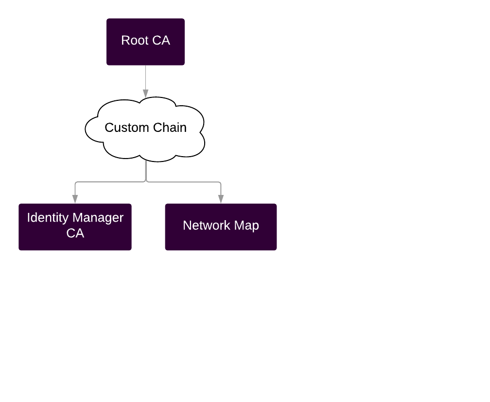
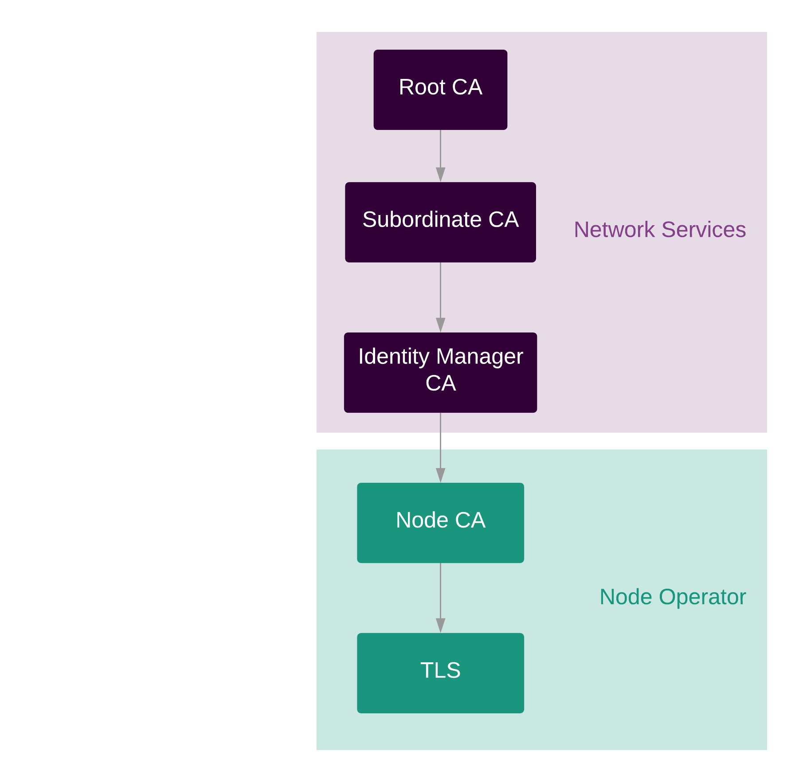
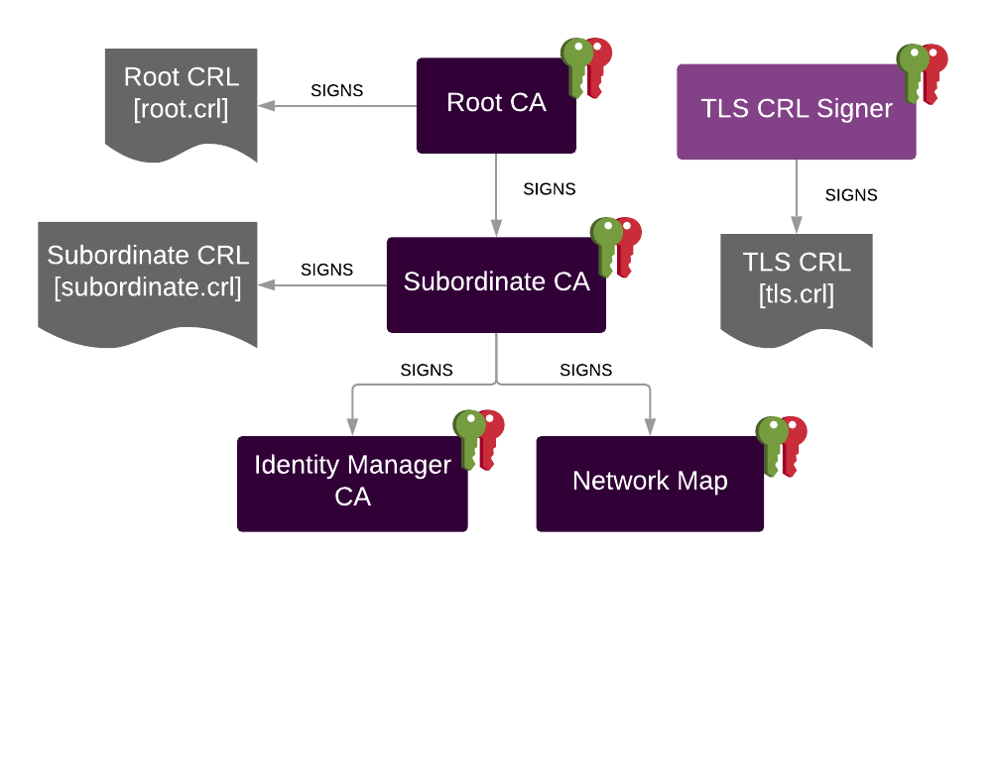

# Certificate Hierarchy Guide

## Overview

The Corda security design heavily relies on the use of Public Key Infrastructure (PKI). The platform itself operates with the assumption that a
certificate authority will manage the node on-boarding and permissioning processes. As such, there is an inherent requirement
to provide an easy approach towards certificate hierarchy generation and deployment.
The PKI Tool provides a simple way to define and create all the keys and certificates for your PKI.

In Corda, we distinguish between two types of PKI entities: Certificate Authorities (CA) and Signers (non-CA).
The difference between the two is that CA can issue certificates and non-CA cannot. The latter one is limited only to signing data.
Each of those entities maintains its own key pair (public and private keys) that is used to authenticate and sign data.
Moreover, each of them needs to be certified (i.e. hold a certificate issued) by another CA.
An entity’s certificate binds the legal name of the entity to its public key, with the signature of the certificate’s issuer providing the attestation to this binding.
As well as issuing certificates, each CA is also responsible for maintaining information about certificate’s validity.
Certificates can become invalid due to different reasons (e.g. keys being compromised or cessation of operation) and as such need to be revoked.
To be able to know which certificates are valid and which are revoked, each CA maintains a Certificate Revocation List (CRL).
That CRL needs to be published such that it can be accessed by anybody who may participate in the network.

With all of the above in mind, the output of the PKI Tool execution is a certificate hierarchy comprising of the key pairs (for each defined entity)
accompanied with the certificates associated with those key pairs as well as signed static certificate revocation lists.

The PKI Tool is intended to make it easy to generate all the certificates needed for a Corda deployment.
The tool generates the keys in the desired key store(s) and outputs a set of certificates necessary for correct Corda Network operation.

## Corda Requirements

Corda nodes operate with the following assumptions on the certificates hierarchy:

* There are two certificates each corresponding to Identity Manager and Network Map.
* They need to have the common root certificate, which is present in the node’s trust store.
The length of the certificate chain can be arbitrary. As such, there can be any number of certificates between the Identity Manager and Network Map certificates as long
as they root to the same certificate.
* They need to have a custom extension defining the role of the certificate in the context of Corda. See here: [https://docs.corda.net/head/permissioning.html#certificate-role-extension](../../open-source/permissioning.html#certificate-role-extension) for more details.

Other than that, Corda nodes stay agnostic to the certificate hierarchy (in particular the depth of the certificate hierarchy tree).

At the time of writing this document, the Corda Network assumes the certificate hierarchy that can be found here: [https://docs.corda.net/head/permissioning.html](../../open-source/permissioning.md) .

### Certificate Revocation List

Every time two nodes communicate with each other they exchange their certificates and validate them against the Certificate Revocation List.
In Corda, the certificate chains of the nodes are validated only during the SSL handshake.
This means that every time an SSL connection is established between two nodes, the TLS certificates (together with the
remaining certificate chain ending at the root certificate) are exchanged and validated at each node.

The network operator is responsible for certificate issuance and maintenance for each certificate starting at the Root certificate and ending
at the Identity Manager and Network Map certificates. The rest of the certificate chain (i.e. every certificate below the Identity Manager certificate) falls into
node operator responsibility.

The certificate revocation list verification applies to the entire chain. This means that every certificate in the chain
is going to be validated against the corresponding certificate revocation list during the SSL handshake.
Consequently, this means that a node operator is expected to provide and maintain the certificate revocation list for the Node CA.
Even though Corda supports this scenario, it might be a tedious task that a node operator does not want to deal with.
As such, Corda offers also an alternative solution, which allows a node to benefit from the certificate revocation list validation and at the
same time waives away the necessity of the certificate revocation list maintenance from the node operator.
The certificate revocation list validation process allows the certificate revocation list to be signed by a third party
authority (i.e. associated key pair) as long as its certificate is self-signed and trusted (i.e. it is present in the node’s trust store).
As such, in Corda, the certificate revocation list for the TLS level is signed by a dedicated self-signed certificate called TLS Signer,
which is then added to node’s trust store (in a similar way as the Corda Root certificate - distributed with the `network-trust-store.jks`).
During the certificate revocation list validation process the trust store is consulted for the presence of the TLS Signer certificate.

## Example Scenario

As an example, let us consider the following certificate hierarchy:

The certificate hierarchy presented above is currently (as of the time of writing this document) used in the Corda Network.
It follows practices applicable for certificate authorities providing a balance between security and simplicity of usage.
In this scenario, a network operator wants to create a CA hierarchy where the self-signed Root CA issues a certificate for the Subordinate CA which in turn issues
two certificates for both Identity Manager CA and Network Map (note that the Network Map is not a CA-type entity).
The root certificate is self-signed and its keys are to be protected with the highest security level. In normal circumstances,
they would be used just once to sign lover-level certificates (in this case the Subordinate CA) and then placed in some secure location,
preferably not being accessed anymore.
Further down in the hierarchy, the Subordinate certificate is then used to issue other certificates for other CAs.
Additionally, there is the TLS CRL signer entity, which is also self-signed and does not act as a CA.
As a matter of fact, for the purpose of signing the TLS CRL, we could reuse the Root CA certificate (as it is self-signed and is assumed to be in the network trust store),
however to keep the split of responsibilities let us assume that the network operator uses a separate certificate for that purpose.
Therefore, the TLS CRL signer certificate’s sole purpose is to sign a certificate revocation list, therefore the security constraints can be relaxed in this case,
compared to those applied to the Root CA.

As mentioned at the beginning of this document, each CA needs to maintain its own certificate revocation list.
Therefore, along with the keys and certificates being created for all of those four entities, three certificate revocation lists
need to be created and signed by Root CA, Subordinate CA and TLS CRL Signer respectively. The TLS CRL Signer differs from the others as,
although it is not a CA, it still signs a certificate revocation list.
That list is used by nodes during the SSL handshake process and in case where a node (which is a CA) is not able to
provide for its own certificate revocation list.
Regarding the Identity Manager, here we assume that the certificate revocation list is kept in the database and therefore no
static (i.e. file based) certificate revocation list signing is required.

With all of those in mind we can see the certificate revocation list of the TLS chain validation process as follows:

* The Root CA certificate is self-signed and trusted (i.e. present in the node’s trust store). As such it does not require any certificate revocation list validation.
* The Subordinate CA certificate is validated by checking the certificate revocation list signed by the Root CA. In the diagram from previous section, it is given as a static file called `root.crl`.
* The Identity Manager CA certificate is validated by checking the certificate revocation list signed by the Subordinate CA. In the diagram from previous section, it is given as a static file called `subordinate.crl`.
* The Node CA certificate is validated by checking the certificate revocation list signed by the Identity Manager CA. This list is dynamically maintained and stored in the database.
* The TLS certificate is validated by checking the certificate revocation list signed by the TLS CRL signer. In the diagram from previous section, it is given as a static file called `tls.crl`.
Alternatively, the node operator may choose to use its own certificate revocation list infrastructure. However, this setup is out of the scope of the example scenario.

To generate all the artifacts of this scenario, a user needs to pass the correct configuration file to the PKI Tool.
The following is the example of the configuration file that will result in generating the above certificate hierarchy:

To simplify things even more, the PKI Tool assumes default values as much as possible so the user
is only required to provide only essential information to the tool. At the same time, the tool allows for overriding those
defaults and have the configuration adjusted to the specific needs of different scenarios.


To learn more about running the tool, see pki-tool.


