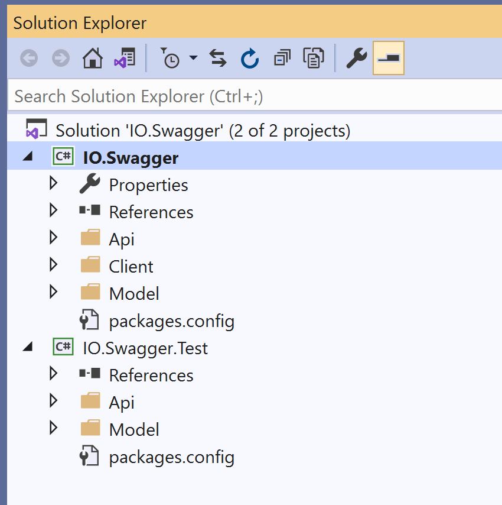
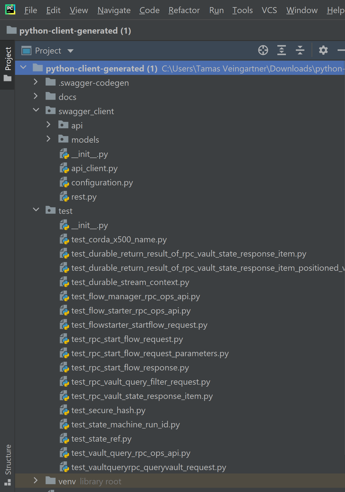
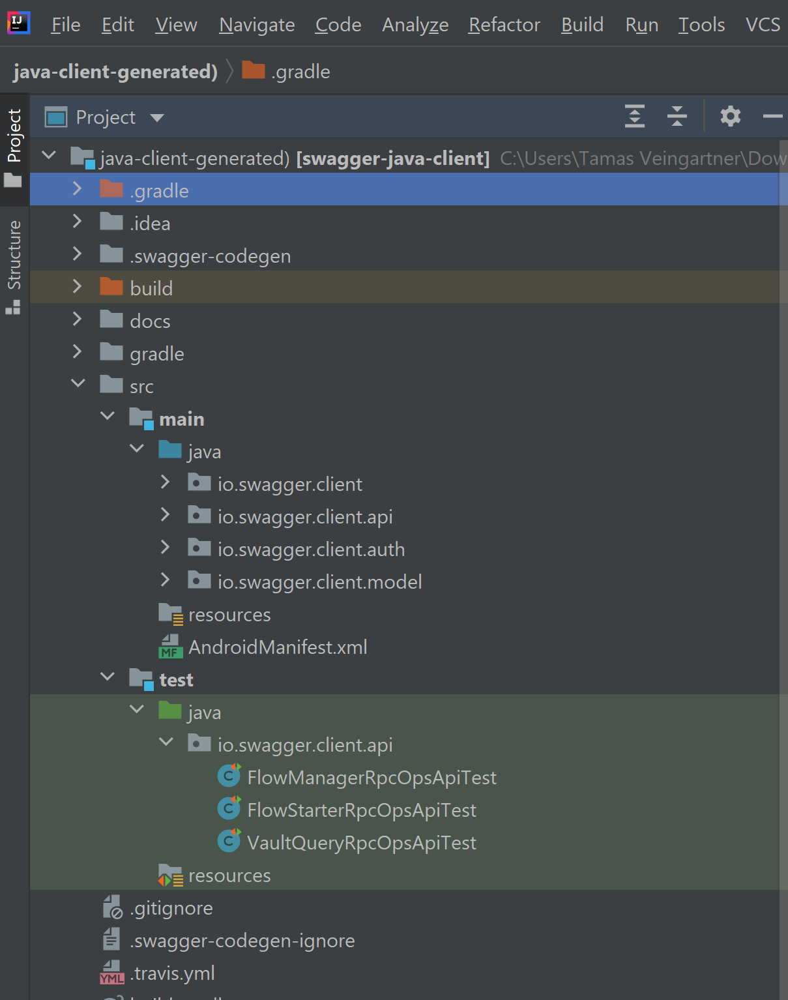

Use this guide to generate client code from the OpenAPI Specification using [Swagger Editor](https://editor.swagger.io).

The HTTP-RPC module exposes web service endpoints and also generates an OpenAPI 3.0 standard `swagger.json` file on
`https://{host}:{port}/{basePath}/v{version}/swagger.json` and Swagger UI on
`https://{host}:{port}/{basePath}/v{version}/swagger`. The OpenAPI specification (formerly known as the Swagger
specification) is for machine-readable interface files for describing, producing, consuming, and visualizing RESTful
web services.

## Generate client code using Swagger Editor

You can use online tools such as [Swagger Editor](https://editor.swagger.io) or
[Swagger Codegen](https://swagger.io/tools/swagger-codegen/) to generate client code in various programming languages
from the OpenAPI specification.



Other tools are available; however, [Swagger](https://swagger.io/solutions/getting-started-with-oas/) is easy to use
and takes full advantage of the OpenAPI Specification's capabilities.



To generate client code:
1. Open [Swagger Editor](https://editor.swagger.io) in your web browser.
2. Paste your `swagger.json` content into the **editor section**.
3. Swagger Editor generates a **Swagger UI**.
4. Click **Generate Client** and select your preferred programming language.
5. Once the code has been generated, download the `.zip` file and extract the files.

Follow these instructions to generate client code in:
* [C#](#generate-client-code-in-c)
* [Python](#generate-client-code-in-python)
* [Java](#generate-client-code-in-java)
* [Kotlin](#generate-client-code-in-kotlin)

### Generate client code in C#

Once you have extracted the files, open the solution in Visual Studio (or your preferred IDE). It contains two
projects: `IO.Swagger` and `IO.Swagger.Test`.

`IO.Swagger` contains three folders:
* `Api` for the generated APIs from your web service endpoints, organized into dedicated classes for each web service resource.
* `Client` for the necessary files for configuring and establishing a connection to your web service.
* `Model` for the model classes, generated based on the OpenAPI schemas used and defined in the web services.



This example shows you how to:
* Set up the connection to your web service.
* Use the generated APIs and models to start a flow and query the vault.
* Reference the `IO.Swagger` project in your tester application.

```csharp
using IO.Swagger.Api;
using IO.Swagger.Client;
using IO.Swagger.Model;
using System.Collections.Generic;

namespace ConsoleApp1
{
    class Program
    {
        static void Main(string[] args)
        {
            System.Net.ServicePointManager.ServerCertificateValidationCallback += (sender, certificate, chain, sslPolicyErrors) => true;
            var conf = new Configuration
            {
                BasePath = "https://localhost:12115/api/v1",
                Username = "user",
                Password = "password"
            };
            var flowstartapi = new FlowStarterRPCOpsApi(conf);
            var rq = new RpcStartFlowRequest("testid", "net.corda.httprpcdemo.workflows.MessageStateIssue",
                new RpcStartFlowRequestParameters("{ \"message\": \"myMessage\" }"));
           var response = flowstartapi.PostFlowstarterStartflow(new FlowstarterStartflowRequest(rq));

            var vaultapi = new VaultQueryRPCOpsApi(conf);
            var result = vaultapi.PostVaultqueryrpcQueryvault(new VaultqueryrpcQueryvaultRequest(
                new RpcVaultQueryFilterRequest(
                    new List<string> { "net.corda.httprpcdemo.contracts.MessageState" }, "2021-04-23T10:23:53.208511Z",
                    new List<string> { "PRODUCE" }, null, "2021-04-19T10:22:53.208812Z", null),
                new DurableStreamContext("PT15M", 0, 30)));
        }
    }
}

```

### Generate client code in Python

Once you have extracted the files, open the folder in your preferred IDE. It contains four folders: `swagger_client`,
`test`, `docs`, and `.swagger_codegen`.

`swagger_client` contains:
* `api` for the generated APIs from your web service endpoints, organized into dedicated classes for each web service resource.
* `models` for the model classes, generated based on the OpenAPI schemas used and defined in the web services.
* Additional files for configuring and establishing the connection to your web service.



This example shows you how to:
* Set up the connection to your web service.
* Use the generated APIs and models to start a flow.
* Import the required classes from the `swagger_client` module in your tester application.

```python
from swagger_client import FlowStarterRPCOpsApi, ApiClient, Configuration, FlowstarterStartflowRequest, \
    RpcStartFlowRequest, RpcStartFlowRequestParameters

conf = Configuration()
conf.host = "https://localhost:12115/api/v1"
conf.username = "user"
conf.password = "password"
conf.verify_ssl = False

apiclient = FlowStarterRPCOpsApi(ApiClient(conf))

flowstarter_startflow_request = FlowstarterStartflowRequest(
    RpcStartFlowRequest("testid",
                        "net.corda.httprpcdemo.workflows.MessageStateIssue",
                        RpcStartFlowRequestParameters("{ \"message\": \"myMessage\" }")))
res = apiclient.post_flowstarter_startflow(flowstarter_startflow_request)
print(res.status)
```

### Generate client code in Java

Once you have extracted the files, open the folder in your preferred IDE and build with Gradle. The project's source
folder contains a `main` and a `test` module.

The `main` module contains four packages:
* `io.swagger.client` contains files for configuring and establishing the connection to your web service.
* `io.swagger.client.api` contains the generated APIs from your web service endpoints, organized into dedicated classes for each web service resource.
* `io.swagger.client.auth` contains files for managing authentication.
* `io.swagger.client.model,` contains the model classes, generated based on the OpenAPI schemas used and defined in the web services.



This example shows you how to:
* Set up the connection to your web service.
* Use the generated APIs and models to start a flow.
* Add a tester `main` class to your project or build a `.jar` from the generated client code and import it into a separate tester application.

```java
import io.swagger.client.ApiClient;
import io.swagger.client.ApiException;
import io.swagger.client.Configuration;
import io.swagger.client.api.FlowStarterRpcOpsApi;
import io.swagger.client.model.FlowstarterStartflowRequest;
import io.swagger.client.model.RpcStartFlowRequest;
import io.swagger.client.model.RpcStartFlowRequestParameters;
import io.swagger.client.model.RpcStartFlowResponse;

class Main {
    public static void main(String[] args){
        ApiClient defaultClient = Configuration.getDefaultApiClient();
        defaultClient.setUsername("user");
        defaultClient.setPassword("password");
        defaultClient.setBasePath("https://localhost:12115/api/v1");
        defaultClient.setVerifyingSsl(false);

        try {
            FlowStarterRpcOpsApi flowStarterRpcOpsApi = new FlowStarterRpcOpsApi(defaultClient);
            RpcStartFlowRequest rpcStartFlowRequest = new RpcStartFlowRequest()
                    .clientId("testid")
                    .flowName("net.corda.httprpcdemo.workflows.MessageStateIssue")
                    .parameters(new RpcStartFlowRequestParameters().parametersInJson("{ \"message\": \"myMessage\" }"));
            RpcStartFlowResponse response = flowStarterRpcOpsApi.postFlowstarterStartflow(
                    new FlowstarterStartflowRequest().rpcStartFlowRequest(rpcStartFlowRequest));
        } catch ( ApiException e) {
            e.printStackTrace();
        }
    }
}
```

### Generate client code in Kotlin

Once you have extracted the files, open the folder in your preferred IDE and build with Gradle.

The project's source folder contains a `main` module, which contains three packages:
* `io.swagger.client.apis` contains the generated APIs from your web service endpoints, organized into dedicated classes for each web service resource.
* `io.swagger.client.infrastructure` contains files for configuring and establishing the connection to your web service.
* `io.swagger.client.models` contains the model classes, generated based on the OpenAPI schemas used and defined in the web services.


This example shows you how to:
* Set up the connection to your web service.
* Use the generated APIs and models to start a flow.
* Add a tester `main` class to your project or build a `.jar` from the generated client code and import it into a separate tester application.

```kotlin
import io.swagger.client.apis.FlowStarterRPCOpsApi
import io.swagger.client.infrastructure.ApiClient
import io.swagger.client.models.FlowstarterStartflowRequest
import io.swagger.client.models.RpcStartFlowRequest
import io.swagger.client.models.RpcStartFlowRequestParameters
import okhttp3.*
import java.lang.Exception
import java.security.SecureRandom
import java.security.cert.CertificateException
import java.security.cert.X509Certificate
import javax.net.ssl.*

fun main() {

    val user ="user1"
    val password = "test"
    val basePath = "https://localhost:12115/api/v1/"
    ApiClient.client = getUnsafeOkHttpClient(user, password)
    val api = FlowStarterRPCOpsApi(basePath)
    val startFlowResp= api.postFlowstarterStartflow(
        FlowstarterStartflowRequest(RpcStartFlowRequest("client","net.corda.httprpcdemo.workflows.MessageStateIssue",
            RpcStartFlowRequestParameters("{\"message\":\"hello\"}")))
    )
}

val trustAllCerts: Array<TrustManager> = arrayOf<TrustManager>(
    object : X509TrustManager {
        @Throws(CertificateException::class)
        override fun checkClientTrusted(
            chain: Array<X509Certificate?>?,
            authType: String?
        ) {
        }
        @Throws(CertificateException::class)
        override fun checkServerTrusted(
            chain: Array<X509Certificate?>?,
            authType: String?
        ) {
        }
        override fun getAcceptedIssuers(): Array<X509Certificate?> {
            return arrayOfNulls(0)
        }
    }
)
/**
 * Converted to kotlin from https://stackoverflow.com/questions/50961123/how-to-ignore-ssl-error-in-okhttp
 */
private fun getUnsafeOkHttpClient(user: String, password: String): OkHttpClient {
    return try {
        // Create a trust manager that does not validate certificate chains

        // Install the all-trusting trust manager
        val sslContext: SSLContext = SSLContext.getInstance("SSL")
        sslContext.init(null, trustAllCerts, SecureRandom())
        // Create an ssl socket factory with our all-trusting manager
        val sslSocketFactory: SSLSocketFactory = sslContext.socketFactory
        OkHttpClient.Builder()
            .sslSocketFactory(sslSocketFactory, trustAllCerts[0] as X509TrustManager)
            .hostnameVerifier { _, _ -> true }
            .authenticator { _, response ->
                val credential: String = Credentials.basic(user, password)
                response.request.newBuilder().header("Authorization", credential).build()
            }.build()
    } catch (e: Exception) {
        throw RuntimeException(e)
    }
}
```
