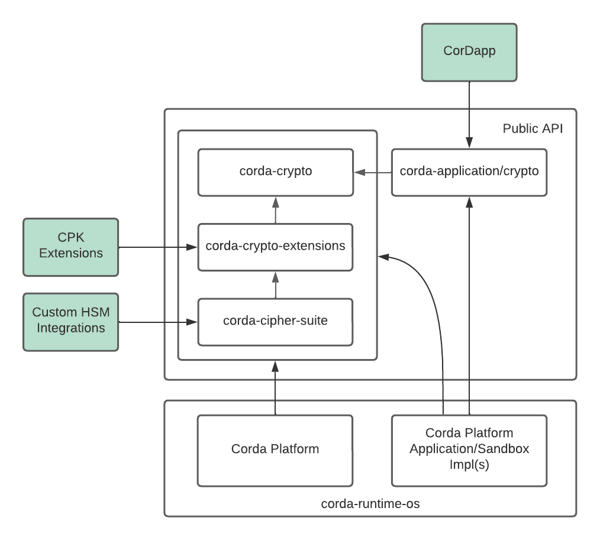

# Overview

The `corda-crypto` module is one of several modules of the `Corda Crypto API`. The module defines low level services that can be used to extend functionality of the Corda Crypto Library by implementing them in a CPK.

The dependencies on Corda Crypto API are shown in the diagram bellow. 



# Extending Supported Digest Algorithms

The Corda Crypto Library implements a wide variety of digest algorithms out of the box. However, you can use a digest algorithm that is not supported by the library by implementing couple of interfaces and adding the code into the CPK with the CorDapp code.

The custom algorithms will be picked by the platform at the run time.

 It's recommended to put the custom digest code into separate JAVA module.


> Note that the digest algorithm have to be cryptographically strong, like MD5 is not a strong algorithm and thus is not supported by the library so don't add that to your CorDapp.


> The custom algorithms cannot be used as implicit part of the digital signing, e.g. you cannot specify the signature spec like 'SHA-256-TRIPLEwithRSA'. If you still wish to use it for signing you have to calculate the digest first and then sign/verify the produced hash using built-in signature specs.


The Double SHA-256 is supported by the platform but lets assume that you want to support Triple SHA-256 where the first pass calculates the message digest and consequent passes calulate digest of the the previous pass result.

In Kotlin he code may look like bellow:

```kotlin
package com.example.crypto

import net.corda.v5.crypto.DigestAlgorithmName
import net.corda.v5.crypto.extensions.DigestAlgorithm
import net.corda.v5.crypto.sha256Bytes
import java.io.InputStream
import java.security.MessageDigest

class TripleSha256Digest : DigestAlgorithm {
    companion object {
        const val ALGORITHM = "SHA-256-TRIPLE"
        const val STREAM_BUFFER_SIZE = DEFAULT_BUFFER_SIZE
    }
    override val algorithm = ALGORITHM
    override val digestLength = 32
    override fun digest(bytes: ByteArray): ByteArray = bytes.sha256Bytes().sha256Bytes().sha256Bytes()
    override fun digest(inputStream: InputStream): ByteArray {
        val messageDigest = MessageDigest.getInstance(DigestAlgorithmName.SHA2_256.name)
        val buffer = ByteArray(STREAM_BUFFER_SIZE)
        while (true) {
            val read = inputStream.read(buffer)
            if (read <= 0) break
            messageDigest.update(buffer, 0, read)
        }
        return messageDigest.digest().sha256Bytes().sha256Bytes()
    }
}
```


```kotlin
package com.example.crypto

import net.corda.v5.crypto.extensions.DigestAlgorithm
import net.corda.v5.crypto.extensions.DigestAlgorithmFactory

class TripleSha256 : DigestAlgorithmFactory {
    override val algorithm: String = TripleSha256Digest.ALGORITHM
    override fun getInstance(): DigestAlgorithm = TripleSha256Digest()
}
```


```groovy
plugins {
    id 'org.jetbrains.kotlin.jvm'
    id 'net.corda.plugins.cordapp-cpk'
}

description 'Corda Crypto Custom Digest One'

group 'com.example.crypto'

cordapp {
    targetPlatformVersion 999 as Integer
    workflow {
        name 'Custom Crypto Digest One CPK'
        versionId 1
        vendor 'R3'
    }
}

dependencies {
    cordaProvided platform("net.corda:corda-api:$cordaApiVersion")
    cordaProvided "net.corda.kotlin:kotlin-stdlib-jdk8-osgi"
    cordaProvided 'net.corda:corda-cipher-suite'
    cordaProvided 'net.corda:corda-crypto'
    cordaProvided 'net.corda:corda-crypto-extensions'
    cordaProvided 'org.slf4j:slf4j-api'
}
```


> Note that you will need to reference the `net.corda:corda-crypto-extensions`


And that's as simple as that.

For the CorDApp packaging instructions see the relevant documentation.
