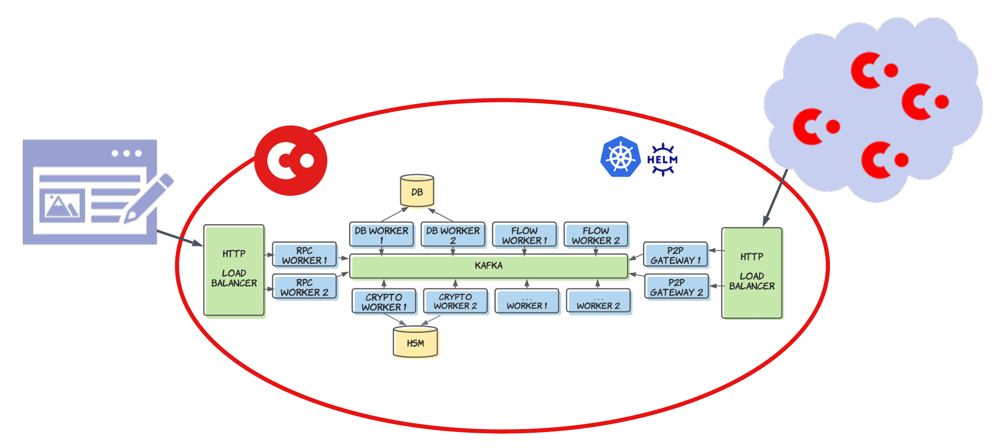

[https://www.corda.net/blog/corda-5-the-road-ahead-part-3-introduction-to-the-architecture/]: #

## Overview

*Corda 5 workers*

Corda 5 uses a microservices-like architecture where the overall solution is split into multiple processes called workers. Each worker is responsible for a different area of functionality. For example, the flow worker is responsible for executing CorDapp flow code. Workers communicate via a Kafka message bus. Each worker is packaged up in a container, which can then be orchestrated using Kubernetes. Workers can be horizontally scaled and, by adding multiple instances of workers, you can achieve high availability.

The key workers delivered with Corda are:
* **Flow worker** — enables peers to communicate and transact.
* Crypto worker??
* RPC worker??
* **Database (DB) worker**  — queries the database, performs any required processing, and returns the results to the caller.
* **All-in-one worker** — contains flow, crypto, database, and RPC processors. This is the lowest-cost configuration for small scale work.
[handles the configuration of virtual nodes, CorDapps, the vault, membership group managers, HSM connections, and RPC.??]: #

## Environment

Workers are Java Virtual Machine (JVM) processes that run in a cluster. Clusters are not always made from the same set of processes. That depends on the topology of a deployment. For example, if it consists of a single node or of multiple nodes. The cluster itself is made up of reusable components.

Most clusters operate in a cloud environment or in containers, which can run on different operating systems and infrastructures (see the support matrix for supported operating systems). Containers package up code and all its dependencies so the application runs quickly and reliably from one computing environment to another. Containers sit above the kernel and share a single instance of the kernel between all containers on the system. These environments are managed through an orchestration layer, such as Kubernetes or OpenShift. Operating clusters like this means that workers:
* Can be run in a hot/hot configuration. This enables multiple independent servers to receive traffic at all times. If one server becomes unavailable, there is an instant failover to the next worker. It also allows for parallelized event processing, increasing throughput in bursty scenarios.
* Benefit from dynamic scaling, as new workers can be added to the cluster with the cluster able to expand and shrink depending on demand.
* Are self-healing. They can recover from hardware failures, some bugs, and short outages of downstream systems. Recovery from longer term outages is also possible, if there are enough systems available to the cluster to provide acceptable service during the failure.
* Can easily be started from the orchestration layer using start-up parameters or environment variable in the event of a failover or scaling scenario.

## Services

A worker is an entry point to one or more processor bundles, a top-level component of a worker cluster. This is the "main" bundle, bootstrapped by the OSGi framework, that starts the JVM process. The worker encapsulates and directly references the processor. Processors are always independent from each other. All interaction between them goes through the message bus.

In addition to processors, you might find these components in a cluster:
* **HTTPS RPC service** — handles RPC requests from clients. It provides the HTTPS REST API for all interactions between the cluster or virtual nodes and external business systems. The RPC service is hot-hot load balanced. You can use the RPC service for all cluster functions, including setting up cluster configuration, editing RPC users, installing virtual nodes, installing CPIs, interacting with virtual nodes and flows, and monitoring.
* **Database service** — provides interaction with the long-term data store in the database. It translates requests for configuration change and virtual node operations into database changes, and routes vault queries from the flow engine to and from the appropriate virtual node schema.
* **Crypto server** — provides interaction with hardware security modules (HSMs) and software emulation of an HSM for all private key and certificate operations.
* **Flow engine service** — contains the flow state machine, which runs your flow code. Typically, the flow engine receives work for a particular flow and virtual node identity, accesses a suitable sandbox based on the [CPI] of the virtual node, and executes the next step of the flow. When the flow execution returns to the framework, it writes the checkpoint back to Kafka and sends events to the other worker processes to carry out the API functionality. The flow engine then takes the next task.
* **Gateway** — provides a secure HTTPS link between clusters that route messages between virtual nodes. You can run the gateway as a separate worker to enhance isolation.

### Libraries
Libraries are a collection of files, programs, routines, scripts, or functions that the components can reference. They are configured and managed externally. Libraries may be dependent on other libraries, but not on components.
